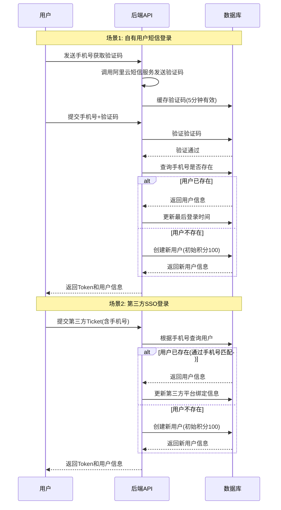
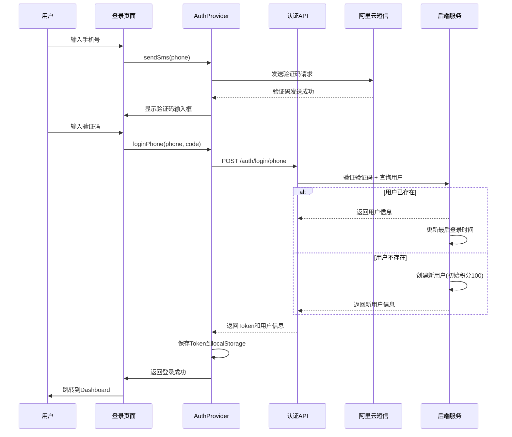
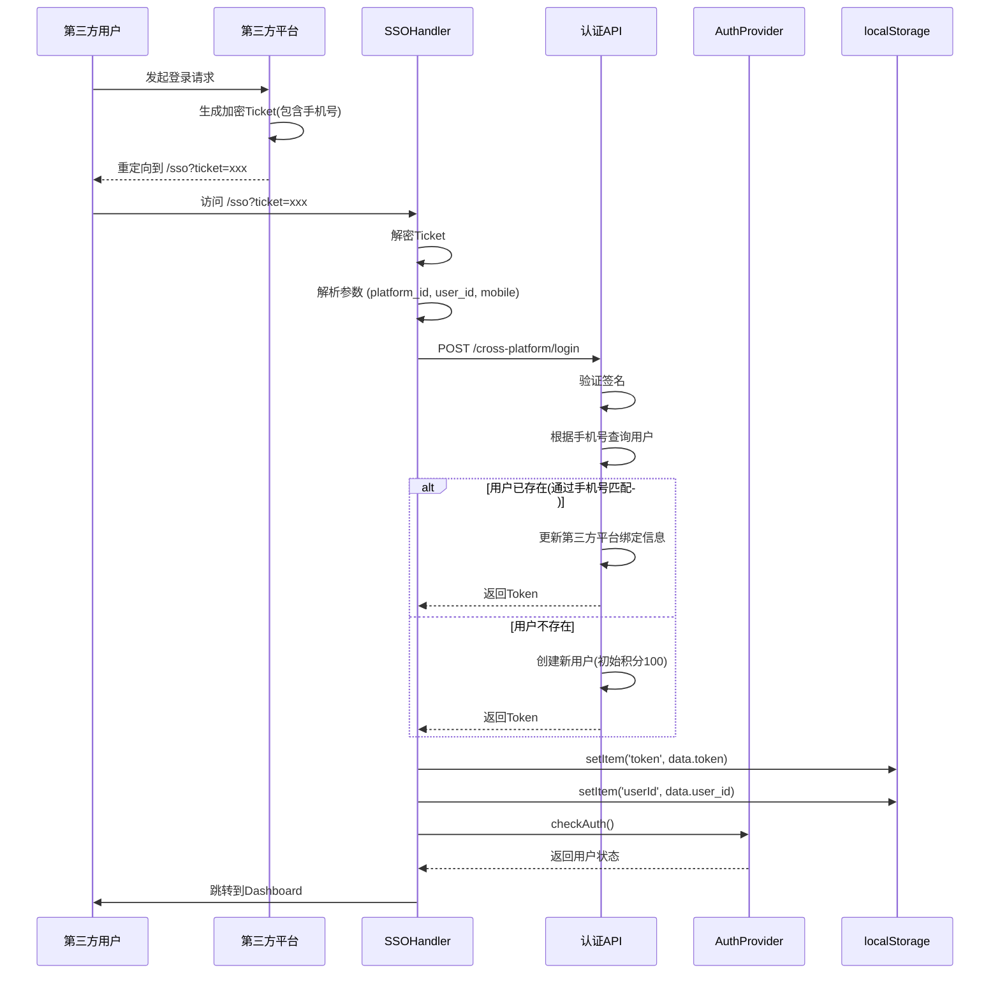
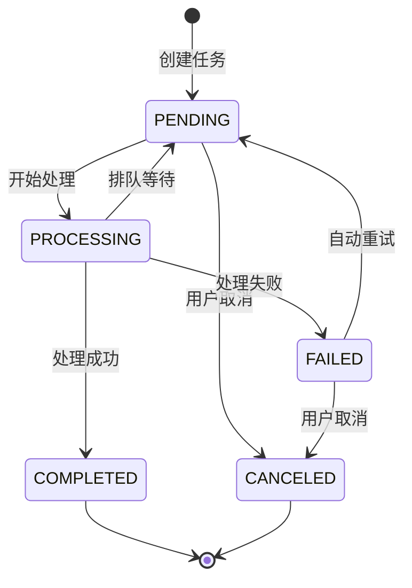

# POD AI Studio 业务建模文档

## 目录

1. [业务概述](#1-业务概述)
2. [核心业务实体](#2-核心业务实体)
3. [登录认证体系](#3-登录认证体系)
4. [图片存储与处理架构](#4-图片存储与处理架构)
5. [图片标签系统](#5-图片标签系统)
6. [积分消耗体系](#6-积分消耗体系)
7. [任务管理系统](#7-任务管理系统)
8. [安全与并发控制](#8-安全与并发控制)
9. [架构设计原则](#9-架构设计原则)
10. [API接口索引](#10-api接口索引)
11. [技术债务与优化建议](#11-技术债务与优化建议)

---

## 1. 业务概述

### 1.1 产品定位
POD AI Studio 是一个面向设计行业的AI图像处理工具平台，提供无损放大、印花提取、四方连续、图片扩展、图像融合、图生图等多种AI图像处理功能。所有图片均用于生产环境，支持4K分辨率大图处理。

### 1.2 目标用户
- 设计师
- 电商运营人员
- 印花图案设计师
- 第三方平台用户（通过SSO接入）

### 1.3 核心业务流程

```
┌─────────────────────────────────────────────────────────────────┐
│                        用户访问流程                               │
├─────────────────────────────────────────────────────────────────┤
│                                                                  │
│   ┌──────────┐    ┌──────────┐    ┌──────────┐    ┌──────────┐ │
│   │  用户登录  │───▶│  选择工具  │───▶│  上传图片  │───▶│  配置参数  │ │
│   └──────────┘    └──────────┘    └──────────┘    └──────────┘ │
│        │                                               │        │
│        ▼                                               ▼        │
│   ┌──────────┐                                  ┌──────────┐   │
│   │ 积分校验  │◀─────────────────────────────────│  提交任务  │   │
│   └──────────┘                                  └──────────┘   │
│        │                                               │        │
│        ▼                                               ▼        │
│   ┌──────────┐                                  ┌──────────┐   │
│   │ 积分扣减  │                                  │  排队等待  │   │
│   └──────────┘                                  └──────────┘   │
│                                                       │        │
│                                                       ▼        │
│   ┌──────────────────────────────────────────────────────────┐ │
│   │                    图片处理引擎                            │ │
│   │  ┌─────────┐  ┌─────────┐  ┌─────────────────────────┐  │ │
│   │  │ 外部API  │  │ ComfyUI │  │ 其他处理服务             │  │ │
│   │  └─────────┘  └─────────┘  └─────────────────────────┘  │ │
│   └──────────────────────────────────────────────────────────┘ │
│                          │                                     │
│                          ▼                                     │
│   ┌──────────┐    ┌──────────┐    ┌──────────┐               │
│   │  任务完成  │───▶│  预览结果  │───▶│  下载保存  │               │
│   └──────────┘    └──────────┘    └──────────┘               │
│                                                                  │
└─────────────────────────────────────────────────────────────────┘
```

---

## 2. 核心业务实体

### 2.1 用户实体 (User)

```typescript
interface User {
  id: string;              // 用户唯一标识
  phone: string;           // 手机号（唯一标识，用于登录和第三方用户关联）
  nickname?: string;       // 昵称
  email?: string;          // 邮箱
  platform?: string;       // 所属平台（第三方接入时使用）
  platformUserId?: string; // 第三方平台用户ID
  points: number;          // 当前积分
  vipLevel?: string;       // VIP等级
  createdAt: Date;         // 创建时间
  lastLoginAt: Date;       // 最后登录时间
}
```

> **新用户默认积分**: 新用户注册/首次登录时自动发放 100 积分

### 2.1.1 用户注册/登录流程



### 2.2 任务实体 (Task)

```typescript
interface Task {
  id: string;                    // 任务ID
  taskId: string;                // 任务ID（兼容字段）
  userId: string;                // 用户ID
  action: string;                // 任务类型: hires, pattern-extract, seamless, etc.
  status: TaskStatus;            // 任务状态
  progress: number;              // 进度 0-100
  imageUrl?: string;             // 原始图片URL
  resultUrl?: string;            // 处理结果URL
  thumbnailUrl?: string;         // 缩略图URL
  params: Record<string, any>;   // 处理参数
  pointsCost: number;            // 消耗积分
  errorMessage?: string;         // 错误信息
  createdAt: Date;               // 创建时间
  updatedAt: Date;               // 更新时间
  completedAt?: Date;            // 完成时间
}

enum TaskStatus {
  PENDING = 'pending',           // 待处理
  PROCESSING = 'processing',     // 处理中
  COMPLETED = 'completed',       // 已完成
  FAILED = 'failed',             // 失败
  CANCELED = 'canceled'          // 已取消
}
```

### 2.3 图片实体 (Image)

```typescript
interface Image {
  id: string;              // 图片ID
  filename: string;        // 文件名
  url: string;             // OSS URL
  thumbnailUrl?: string;   // 缩略图URL
  size: number;            // 文件大小
  width: number;           // 宽度
  height: number;          // 高度
  format: string;          // 格式
  userId: string;          // 所属用户
  createdAt: Date;         // 上传时间
}
```

### 2.4 积分记录实体 (PointsTransaction)

```typescript
interface PointsTransaction {
  id: string;              // 记录ID
  userId: string;          // 用户ID
  changeType: ChangeType;  // 变动类型
  pointsType: PointsType;  // 积分类型
  amount: number;          // 变动数量（正数为增加，负数为扣减）
  beforeBalance: number;   // 变动前余额
  afterBalance: number;    // 变动后余额
  taskId?: string;         // 相关任务ID
  description?: string;    // 说明
  createdAt: Date;         // 创建时间
}

enum ChangeType {
  INCREASE = 'increase',   // 增加
  DECREASE = 'decrease'    // 扣减
}

enum PointsType {
  TASK_CONSUMPTION = 'task_consumption',  // 任务消耗
  SYSTEM_GRANT = 'system_grant',          // 系统发放
  VIP_BONUS = 'vip_bonus',                // VIP奖励
  REFUND = 'refund',                      // 退款
  ADMIN_ADJUST = 'admin_adjust'           // 管理员调整
}
```

---

## 3. 登录认证体系

### 3.1 认证方式概览

```
┌─────────────────────────────────────────────────────────────────┐
│                       认证方式总览                                │
├─────────────────────────────────────────────────────────────────┤
│                                                                  │
│  ┌──────────────────────────────────────────────────────────┐   │
│  │              自有用户认证（唯一方式）                        │   │
│  │                                                          │   │
│  │  ┌─────────────┐  ┌─────────────────────────────────┐   │   │
│  │  │ 阿里云短信  │  │  手机号 + 验证码登录              │   │   │
│  │  │  验证码服务 │  │  (首次登录自动创建用户)           │   │   │
│  │  └─────────────┘  └─────────────────────────────────┘   │   │
│  └──────────────────────────────────────────────────────────┘   │
│                                                                  │
│  ┌──────────────────────────────────────────────────────────┐   │
│  │                     第三方SSO接入                          │   │
│  │                                                          │   │
│  │  ┌─────────────┐  ┌─────────────────────────────────┐   │   │
│  │  │ 加密Ticket  │  │  根据手机号判断/创建用户          │   │   │
│  │  │   解密      │  │  (新用户自动发放100积分)          │   │   │
│  │  └─────────────┘  └─────────────────────────────────┘   │   │
│  └──────────────────────────────────────────────────────────┘   │
│                                                                  │
└─────────────────────────────────────────────────────────────────┘
```

### 3.2 自有用户认证流程（短信验证码）



### 3.3 第三方SSO认证流程



### 3.4 阿里云短信服务配置

```typescript
// 阿里云短信配置
const ALIYUN_SMS_CONFIG = {
  accessKeyId: process.env.ALIYUN_ACCESS_KEY_ID,
  accessKeySecret: process.env.ALIYUN_ACCESS_KEY_SECRET,
  signName: 'PODAI',                     // 短信签名
  templateCode: 'SMS_123456789',         // 短信模板CODE
  // 验证码模板: 您的验证码为${code}，5分钟内有效，请勿泄露。
  expireMinutes: 5,                      // 验证码有效期
  retryLimit: 3,                         // 验证码错误重试次数
};

// 验证码发送频率限制
const SMS_RATE_LIMITS = {
  perPhone: {
    perMinute: 1,       // 每分钟最多1次
    perHour: 5,         // 每小时最多5次
    perDay: 20,         // 每天最多20次
  },
};
```

### 3.5 认证安全设计

#### 3.5.1 Token管理
```typescript
// Token存储策略
const TOKEN_STORAGE_KEYS = {
  TOKEN: 'token',           // JWT Token
  USER_ID: 'userId',        // 用户ID
  PLATFORM: 'platform',     // 平台标识
};

// Token过期处理
http.interceptors.response.use(
  (response) => response,
  (error) => {
    if (error.response?.status === 401) {
      // 清除认证信息
      removeToken();
      localStorage.removeItem('userId');
      localStorage.removeItem('X-User-Id');
      window.dispatchEvent(new CustomEvent('auth:unauthorized'));
      window.location.href = '/login';
    }
    return Promise.reject(error);
  }
);
```

#### 3.5.2 SSO Ticket安全
```typescript
// Ticket加密参数
const SSO_CONFIG = {
  KEY_STR: '8f2d9c4b5a7e1f3d6c8b0a9e7f4d2c1b',  // AES密钥
  ST: 'k7p2m9v4x8n1q5z3',                       // IV派生盐值
  HMAC_SECRET: 'your-hmac-secret',              // HMAC签名密钥
};

// Ticket格式: platform_id|user_id|mobile|timestamp
// 1. AES-256-CBC加密
// 2. HMAC-SHA256签名验证
```

### 3.6 用户手机号唯一性保证

```typescript
// 用户表设计(伪SQL)
CREATE TABLE users (
    id BIGINT PRIMARY KEY AUTO_INCREMENT,
    phone VARCHAR(20) NOT NULL UNIQUE COMMENT '手机号(唯一标识)',
    nickname VARCHAR(100) COMMENT '昵称',
    email VARCHAR(200) COMMENT '邮箱',
    platform VARCHAR(50) COMMENT '所属平台(第三方登录时)',
    platform_user_id VARCHAR(100) COMMENT '第三方平台用户ID',
    points INT DEFAULT 100 COMMENT '积分余额(新用户默认100)',
    vip_level VARCHAR(20) COMMENT 'VIP等级',
    created_at DATETIME DEFAULT CURRENT_TIMESTAMP,
    last_login_at DATETIME,
    UNIQUE KEY uk_phone (phone),
    INDEX idx_platform_user (platform, platform_user_id)
) ENGINE=InnoDB DEFAULT CHARSET=utf8mb4;
```

### 3.7 认证架构优化建议

| 问题 | 当前方案 | 优化方案 |
|------|----------|----------|
| 多平台用户映射 | 每次SSO登录创建新用户 | 建立用户-平台映射表，支持账号绑定 |
| Token续期 | 无自动续期机制 | 实现Token刷新机制 |
| 并发登录 | 多端共存 | 支持单端登录或多端踢出 |
| 登录态检测 | 每次请求401才发现 | 心跳检测 + WebSocket推送 |

---

## 4. 图片存储与处理架构

### 4.1 存储架构

```
┌─────────────────────────────────────────────────────────────────┐
│                       图片存储架构                                │
├─────────────────────────────────────────────────────────────────┤
│                                                                  │
│  ┌─────────────────────────────────────────────────────────┐    │
│  │                      阿里云 OSS                          │    │
│  │  ┌─────────────┐  ┌─────────────┐  ┌─────────────────┐ │    │
│  │  │  存储桶     │  │  CDN加速    │  │  图片处理       │ │    │
│  │  │  podi-oss   │  │  全球节点   │  │  (样式处理)     │ │    │
│  │  └─────────────┘  └─────────────┘  └─────────────────┘ │    │
│  └─────────────────────────────────────────────────────────┘    │
│                                                                  │
│  上传限制:                                                       │
│  - 文件大小: ≥5MB (支持生产级大图)                               │
│  - 分辨率: 支持4K (3840x2160) 及更高                             │
│  - 格式: JPG, PNG, WebP, TIFF                                   │
│                                                                  │
│  前端上传策略:                                                   │
│  - 小文件(≤10MB): 预签名URL直传                                  │
│  - 大文件(>10MB): 分片上传 + 断点续传                            │
│  - 缩略图: OSS图片处理自动生成                                    │
│                                                                  │
└─────────────────────────────────────────────────────────────────┘
```

### 4.2 处理引擎架构

```
┌─────────────────────────────────────────────────────────────────┐
│                      图片处理引擎架构                             │
├─────────────────────────────────────────────────────────────────┤
│                                                                  │
│                        任务调度器                                 │
│  ┌─────────────────────────────────────────────────────────┐    │
│  │  任务队列管理  │  负载均衡  │  重试机制  │  限流控制      │    │
│  └─────────────────────────────────────────────────────────┘    │
│                              │                                   │
│              ┌───────────────┼───────────────┼───────────────┐  │
│              ▼               ▼               ▼               ▼  │
│  ┌───────────────┐ ┌───────────────┐ ┌────────────────────┐┌──┐│
│  │   外部API      │ │   ComfyUI     │ │    豆包VL模型      ││...││
│  │  ┌─────────┐  │ │  ┌─────────┐  │ │  图片标签识别      ││   ││
│  │  │百度智能云│  │ │  │  队列A   │  │ │  (主色/元素/风格) ││   ││
│  │  │扩图能力  │  │ │  │  (GPU1) │  │ │                    ││   ││
│  │  └─────────┘  │ │  └─────────┘  │ └────────────────────┘┘   ││
│  │  ┌─────────┐  │ │  ┌─────────┐  │                          ││
│  │  │ 其他AI  │  │ │  │  队列B   │  │                          ││
│  │  │ 能力    │  │ │  │  (GPU2) │  │                          ││
│  │  └─────────┘  │ │  └─────────┘  │                          ││
│  └───────────────┘ └───────────────┘                          ││
│                              │                                  ││
│              ┌───────────────┼───────────────┐                  ││
│              ▼               ▼               ▼                  ││
│  ┌──────────────────┐ ┌──────────────┐ ┌──────────────────┐    ││
│  │    处理结果       │ │   异常处理   │ │   积分回滚       │    ││
│  │  - 结果URL        │ │  - 错误记录  │ │  (任务失败时)    │    ││
│  │  - 缩略图         │ │  - 告警通知  │ │                  │    ││
│  │  - 标签信息       │ │  - 自动重试  │ │                  │    ││
│  │  - 元数据         │ │  - 熔断降级  │ │                  │    ││
│  └──────────────────┘ └──────────────┘ └──────────────────┘    ││
│                                                                  │
└─────────────────────────────────────────────────────────────────┘
```

### 4.3 第三方AI能力清单

| 能力类型 | 服务商 | 用途 | 备注 |
|----------|--------|------|------|
| 图片扩图 | 百度智能云 | 图像扩展/外扩 | 主扩图能力 |
| 图片标签 | 豆包VL模型 | 异步标签识别 | 主色/元素/风格/来源 |
| ComfyUI | 自建GPU集群 | 复杂图像处理 | 印花提取/重绘等 |
| 预留扩展 | - | 预留 | 可接入更多能力 |

### 4.4 API限流与失效处理

#### 4.4.1 限流管理策略

```typescript
// API限流配置
const API_RATE_LIMITS = {
  'baidu-api': {
    requestsPerMinute: 60,
    requestsPerHour: 1000,
    retryAfter: 60000,  // 被限流后等待时间
  },
  'openai-api': {
    requestsPerMinute: 30,
    requestsPerHour: 500,
    retryAfter: 120000,
  },
};

// 限流检测与处理
async function handleAPIRequest<T>(
  apiName: string,
  request: () => Promise<T>
): Promise<T> {
  const config = API_RATE_LIMITS[apiName];
  const now = Date.now();

  // 检查是否被限流
  if (isRateLimited(apiName)) {
    const waitTime = getRetryAfter(apiName);
    throw new RateLimitError(`API限流，请等待${waitTime/1000}秒`, waitTime);
  }

  try {
    const result = await request();
    incrementRequestCount(apiName);
    return result;
  } catch (error) {
    if (isRateLimitError(error)) {
      setRateLimited(apiName, config.retryAfter);
      throw error;
    }
    throw error;
  }
}
```

#### 4.4.2 API Key失效处理

```typescript
// API Key健康检查
class APIKeyManager {
  private keyStatus: Map<string, KeyStatus> = new Map();

  async checkKeyHealth(apiName: string, key: string): Promise<boolean> {
    try {
      const response = await testAPIKey(apiName, key);
      this.keyStatus.set(key, {
        valid: response.success,
        lastCheck: Date.now(),
        errorCount: 0,
      });
      return response.success;
    } catch (error) {
      const status = this.keyStatus.get(key);
      if (status) {
        status.errorCount++;
        status.lastCheck = Date.now();
        status.valid = status.errorCount < MAX_ERROR_COUNT;
      }
      return false;
    }
  }

  async getValidKey(apiName: string): Promise<string | null> {
    const keys = this.getKeysForAPI(apiName);
    for (const key of keys) {
      const status = this.keyStatus.get(key);
      if (!status || status.valid) {
        // 验证Key是否仍然有效
        if (await this.checkKeyHealth(apiName, key)) {
          return key;
        }
      }
    }
    return null;
  }
}
```

### 4.5 ComfyUI处理机制

```typescript
// ComfyUI任务管理
interface ComfyUITask {
  id: string;
  workflow: object;      // 工作流定义
  inputImages: string[]; // 输入图片URLs
  outputImages: string[];// 输出图片URLs
  status: 'queued' | 'running' | 'completed' | 'failed';
  queuePosition?: number;
  progress?: number;
  priority: number;      // 任务优先级
  retryCount: number;    // 重试次数
  maxRetries: number;
  createdAt: Date;
  startedAt?: Date;
  completedAt?: Date;
}

// ComfyUI负载均衡
class ComfyUIManager {
  private gpuQueues: Map<string, GPUQueue> = new Map();
  private maxQueueSize = 10;

  async submitTask(task: ComfyUITask): Promise<string> {
    // 选择负载最低的GPU队列
    const selectedGPU = this.selectOptimalGPU();

    if (selectedGPU.queue.length >= this.maxQueueSize) {
      // 尝试其他队列或进入等待队列
      const alternativeGPU = this.findAvailableGPU();
      if (!alternativeGPU) {
        throw new QueueFullError('所有GPU队列繁忙');
      }
      selectedGPU = alternativeGPU;
    }

    selectedGPU.addTask(task);
    return task.id;
  }

  private selectOptimalGPU(): GPUQueue {
    // 选择队列中任务数最少且GPU利用率最低的队列
    return this.gpuQueues.values().minBy(gpu =>
      gpu.queue.length * 0.7 + gpu.gpuUtilization * 0.3
    );
  }
}
```

### 4.6 存储与处理优化建议

| 优化项 | 当前方案 | 优化方案 |
|--------|----------|----------|
| 图片上传 | Base64直传 | 预签名URL + 分片上传 |
| 图片存储 | 单Bucket | 多Bucket + 生命周期管理 |
| 缩略图 | 实时生成 | 首次访问生成 + 缓存 |
| CDN | 基础配置 | 智能路由 + 边缘计算 |
| API容错 | 无 | 多API备选 + 熔断器 |

---

## 5. 图片标签系统

### 5.1 标签识别概述

图片标签系统是异步服务，在图片上传或任务完成后自动触发，使用**豆包VL模型**对图片进行智能分析识别。

```
┌─────────────────────────────────────────────────────────────────┐
│                     图片标签识别流程                              │
├─────────────────────────────────────────────────────────────────┤
│                                                                  │
│  图片上传/任务完成                                                │
│        │                                                        │
│        ▼                                                        │
│  ┌─────────────────────────────────────────────────────────┐   │
│  │                   标签识别任务队列                        │   │
│  │              (异步处理，不阻塞主流程)                      │   │
│  └─────────────────────────────────────────────────────────┘   │
│        │                                                        │
│        ▼                                                        │
│  ┌─────────────────────────────────────────────────────────┐   │
│  │                   豆包VL模型调用                          │   │
│  │  ┌─────────────────────────────────────────────────────┐ │   │
│  │  │  输入: 图片URL                                        │ │   │
│  │  │  输出: JSON格式标签结果                               │ │   │
│  │  └─────────────────────────────────────────────────────┘ │   │
│  └─────────────────────────────────────────────────────────┘   │
│        │                                                        │
│        ▼                                                        │
│  ┌─────────────────────────────────────────────────────────┐   │
│  │                   标签数据存储                            │   │
│  │  - 主色(一个颜色)                                         │   │
│  │  - 核心元素                                               │   │
│  │  - 风格关键词                                             │   │
│  │  - 来源信息(如果能识别)                                   │   │
│  └─────────────────────────────────────────────────────────┘   │
│                                                                  │
└─────────────────────────────────────────────────────────────────┘
```

### 5.2 标签识别内容

```typescript
// 图片标签数据结构
interface ImageTags {
  // 主色（一个颜色，十六进制格式）
  primaryColor: string;      // e.g., "#FF5733" 或 "rgb(255, 87, 51)"

  // 核心元素列表
  coreElements: string[];    // e.g., ["花卉", "几何图案", "渐变"]

  // 风格关键词列表
  styleKeywords: string[];   // e.g., ["波西米亚", "现代简约", "复古"]

  // 来源信息（如果能识别）
  sourceInfo?: {
    platform?: string;       // 来源平台
    isAiGenerated?: boolean; // 是否AI生成
    confidence?: number;     // 识别置信度 0-1
  };

  // 元数据
  modelVersion: string;      // 豆包模型版本
  recognizedAt: Date;        // 识别时间
}
```

### 5.3 标签识别示例

```typescript
// 豆包VL模型返回的标签示例
const imageTagExample: ImageTags = {
  primaryColor: "#2C3E50",  // 深蓝色
  coreElements: [
    "几何图案",
    "菱形纹样",
    "对称设计"
  ],
  styleKeywords: [
    "现代简约",
    "商务风格",
    "低饱和度"
  ],
  sourceInfo: {
    platform: "unsplash",
    isAiGenerated: false,
    confidence: 0.89
  },
  modelVersion: "doubao-vl-1.5",
  recognizedAt: new Date("2024-01-06T10:30:00Z")
};
```

### 5.4 标签系统与业务集成

```typescript
// 标签识别触发时机
enum TagRecognitionTrigger {
  ON_UPLOAD = 'on_upload',           // 上传时触发
  ON_TASK_COMPLETE = 'on_task_complete', // 任务完成时触发
  MANUAL = 'manual',                 // 手动触发
}

// 标签应用场景
const TAG_APPLICATIONS = {
  // 图片搜索增强
  search: {
    enable: true,
    fields: ['coreElements', 'styleKeywords', 'primaryColor'],
  },
  // 智能推荐
  recommendation: {
    enable: true,
    weight: {
      styleKeywords: 0.4,
      coreElements: 0.4,
      primaryColor: 0.2,
    },
  },
  // 分类自动打标
  autoCategory: {
    enable: true,
    threshold: 0.7,  // 置信度阈值
  },
};
```

### 5.5 标签识别性能与限流

```typescript
// 标签识别配置
const TAG_RECOGNITION_CONFIG = {
  provider: 'doubao',
  model: 'doubao-vl-1.5',

  // 限流配置
  rateLimit: {
    requestsPerMinute: 30,    // 每分钟30次
    requestsPerHour: 500,     // 每小时500次
  },

  // 超时配置
  timeout: 30000,             // 30秒超时

  // 重试配置
  retry: {
    maxAttempts: 3,
    delayMs: 5000,            // 重试间隔
  },

  // 优先级（任务完成后触发优先于上传时触发）
  priority: {
    onTaskComplete: 1,        // 最高优先级
    onUpload: 2,              // 普通优先级
    manual: 3,                // 手动触发最低优先级
  },
};
```

---

## 6. 积分消耗体系

### 6.1 积分模型

```
┌─────────────────────────────────────────────────────────────────┐
│                        积分模型                                  │
├─────────────────────────────────────────────────────────────────┤
│                                                                  │
│  ┌──────────────────────────────────────────────────────────┐   │
│  │                     用户积分账户                           │   │
│  │  ┌───────────┐  ┌───────────┐  ┌─────────────────────┐   │   │
│  │  │  总积分   │  │  冻结积分  │  │  临时积分(午夜发放)  │   │   │
│  │  │ totalPoints│ │ frozenPoints│ │ tempPoints         │   │   │
│  │  └───────────┘  └───────────┘  └─────────────────────┘   │   │
│  └──────────────────────────────────────────────────────────┘   │
│                                                                  │
│  积分来源:                                                       │
│  - 新用户注册(首次登录) -> 100积分                                │
│  - 每日签到                                                     │
│  - VIP月卡/季卡                                                 │
│  - 充值购买                                                     │
│  - 任务奖励                                                     │
│                                                                  │
│  积分消耗:                                                       │
│  - AI任务处理                                                   │
│  - 图片下载(非VIP)                                              │
│  - 高级功能使用                                                 │
│                                                                  │
└─────────────────────────────────────────────────────────────────┘
```

### 6.2 积分消耗规则

```typescript
// 积分消耗配置
const POINTS_CONFIG = {
  // 各工具消耗积分
  consumption: {
    'hires': 10,              // 无损放大
    'pattern-extract': 15,    // 印花提取
    'seamless': 20,           // 四方连续
    'twoway': 20,             // 两方连续
    'extend': 8,              // 图片扩展
    'merge': 25,              // 图片融合
    'img2img': 20,            // 图生图
    'fission': 30,            // 图裂变
  },

  // 批量处理折扣
  batchDiscount: {
    minCount: 5,              // 最小批量数
    discountRate: 0.9,        // 9折
    minCount: 10,
    discountRate: 0.8,        // 8折
  },

  // VIP折扣
  vipDiscount: {
    'silver': 0.95,
    'gold': 0.9,
    'platinum': 0.8,
  },
};

// 积分预扣与结算
async function processTaskWithPoints(
  userId: string,
  action: string,
  imageCount: number
): Promise<{ success: boolean; cost: number }> {
  // 1. 计算消耗积分
  const baseCost = POINTS_CONFIG.consumption[action] * imageCount;
  const user = await getUserInfo(userId);

  // 2. 应用VIP折扣
  const vipDiscount = POINTS_CONFIG.vipDiscount[user.vipLevel] || 1;
  const discountedCost = Math.round(baseCost * vipDiscount);

  // 3. 批量折扣
  let finalCost = discountedCost;
  if (imageCount >= 10) {
    finalCost = Math.round(discountedCost * POINTS_CONFIG.batchDiscount[10]);
  } else if (imageCount >= 5) {
    finalCost = Math.round(discountedCost * POINTS_CONFIG.batchDiscount[5]);
  }

  // 4. 预扣积分
  const balance = await getUserPoints(userId);
  if (balance < finalCost) {
    throw new InsufficientPointsError('积分不足');
  }

  // 5. 冻结积分
  await freezePoints(userId, finalCost);

  return { success: true, cost: finalCost };
}
```

### 6.3 积分动画效果

```typescript
// 积分变动动画管理
class PointsAnimationManager {
  // 扣减动画
  startDeductionAnimation(amount: number): void {
    const from = currentPoints;
    const to = Math.max(0, from - amount);

    // 1. 数值滚动效果
    animateValue(from, to, DEDUCTION_DURATION);

    // 2. 下沉提示横幅
    showToast({
      type: 'deduction',
      amount,
      remaining: to,
    });
  }

  // 增加动画
  startAdditionAnimation(amount: number): void {
    const from = currentPoints;
    const to = from + amount;

    // 绿色上浮提示
    showToast({
      type: 'addition',
      amount,
    });
  }

  // 临时积分发放动画
  startMidnightGrantAnimation(amount: number): void {
    // 特殊光效 + 烟花
    showGrantEffect(amount);
  }
}
```

---

## 7. 任务管理系统

### 7.1 任务状态流转



### 7.2 任务轮询机制

```typescript
// useTaskListPolling Hook
interface PollingConfig {
  checkInterval: number;        // 轮询间隔 (默认1000ms)
  alwaysPoll: boolean;          // 无活跃任务时继续轮询
  enableActivityResume: boolean; // 用户活动时恢复轮询
  maxRetries: number;           // 最大重试次数
}

class TaskPollingManager {
  private pollingTimer: NodeJS.Timeout | null = null;
  private isPolling: boolean = false;
  private retryCount: number = 0;

  // 智能轮询策略
  getPollingInterval(taskStatus: TaskStatus): number {
    switch (taskStatus) {
      case 'pending': return 2000;   // 排队中，较长间隔
      case 'processing': return 1000; // 处理中，短间隔
      case 'completed': return 0;    // 完成，停止轮询
      case 'failed': return 0;       // 失败，停止轮询
      default: return 1000;
    }
  }

  // 页面可见性处理
  handleVisibilityChange(): void {
    if (document.hidden) {
      this.stopPolling();
    } else {
      this.resumePolling();
    }
  }

  // 用户活动检测恢复
  handleUserActivity(): void {
    if (!this.isPolling && this.hasActiveTasks()) {
      this.startPolling();
    }
  }
}
```

### 7.3 任务队列管理

```typescript
interface TaskQueue {
  id: string;
  name: string;
  priority: number;
  maxConcurrent: number;  // 最大并发数
  currentCount: number;   // 当前运行数
  waitingTasks: Task[];
}

class TaskQueueManager {
  private queues: Map<string, TaskQueue> = new Map();

  // 添加任务到队列
  async addToQueue(task: Task): Promise<void> {
    const queue = this.getOrCreateQueue(task.priority);

    if (queue.currentCount < queue.maxConcurrent) {
      // 直接执行
      this.executeTask(task);
    } else {
      // 加入等待队列
      queue.waitingTasks.push(task);
    }
  }

  // 任务完成回调
  onTaskComplete(task: Task): void {
    const queue = this.getQueue(task.priority);
    queue.currentCount--;

    // 尝试执行等待队列中的任务
    if (queue.waitingTasks.length > 0) {
      const nextTask = queue.waitingTasks.shift();
      if (nextTask) {
        this.executeTask(nextTask);
      }
    }
  }
}
```

---

## 8. 安全与并发控制

### 8.1 安全防护体系

```
┌─────────────────────────────────────────────────────────────────┐
│                       安全防护体系                                │
├─────────────────────────────────────────────────────────────────┤
│                                                                  │
│  ┌──────────────────────────────────────────────────────────┐   │
│  │                     认证安全                               │   │
│  │  - JWT Token (短期有效)                                   │   │
│  │  - Token刷新机制                                          │   │
│  │  - 设备指纹绑定                                           │   │
│  │  - 异常登录检测                                           │   │
│  └──────────────────────────────────────────────────────────┘   │
│                                                                  │
│  ┌──────────────────────────────────────────────────────────┐   │
│  │                     接口安全                               │   │
│  │  - 请求签名验证                                           │   │
│  │  - 参数校验                                               │   │
│  │  - SQL注入防护                                            │   │
│  │  - XSS防护                                                │   │
│  │  - Rate Limiting                                          │   │
│  └──────────────────────────────────────────────────────────┘   │
│                                                                  │
│  ┌──────────────────────────────────────────────────────────┐   │
│  │                     数据安全                               │   │
│  │  - 图片访问权限控制                                       │   │
│  │  - 用户数据隔离                                           │   │
│  │  - 敏感信息加密                                           │   │
│  │  - 操作日志记录                                           │   │
│  └──────────────────────────────────────────────────────────┘   │
│                                                                  │
│  ┌──────────────────────────────────────────────────────────┐   │
│  │                     基础设施安全                           │   │
│  │  - HTTPS强制                                              │   │
│  │  - API密钥管理                                            │   │
│  │  - OSS访问控制                                           │   │
│  │  - 数据库加密                                             │   │
│  └──────────────────────────────────────────────────────────┘   │
│                                                                  │
└─────────────────────────────────────────────────────────────────┘
```

### 7.2 并发控制策略

```typescript
// 1. 用户级并发控制
const USER_CONCURRENT_LIMIT = 3;

// 2. 全局限流
const GLOBAL_RATE_LIMITS = {
  requestsPerSecond: 100,
  requestsPerMinute: 3000,
  requestsPerHour: 50000,
};

// 3. API Key级限流
class RateLimiter {
  private tokenBucket: TokenBucket;
  private fixedWindow: FixedWindowCounter;

  async acquireToken(apiName: string): Promise<boolean> {
    // 令牌桶算法处理突发流量
    if (this.tokenBucket.tryConsume(apiName)) {
      return true;
    }

    // 固定窗口算法处理持续流量
    if (this.fixedWindow.isAllowed(apiName)) {
      return true;
    }

    return false;
  }
}

// 4. 任务级并发控制
class TaskConcurrencyController {
  private runningTasks: Map<string, Set<string>> = new Map();
  private limit: number = USER_CONCURRENT_LIMIT;

  async acquireSlot(userId: string, taskId: string): Promise<boolean> {
    const userTasks = this.runningTasks.get(userId) || new Set();

    if (userTasks.size >= this.limit) {
      return false;
    }

    userTasks.add(taskId);
    this.runningTasks.set(userId, userTasks);
    return true;
  }

  releaseSlot(userId: string, taskId: string): void {
    const userTasks = this.runningTasks.get(userId);
    if (userTasks) {
      userTasks.delete(taskId);
      if (userTasks.size === 0) {
        this.runningTasks.delete(userId);
      }
    }
  }
}
```

### 7.3 熔断与降级

```typescript
// 熔断器配置
const CIRCUIT_BREAKER_CONFIG = {
  failureThreshold: 5,        // 失败次数阈值
  successThreshold: 2,        // 恢复成功次数
  timeout: 60000,             // 熔断超时时间(ms)
};

// 熔断器实现
class CircuitBreaker {
  private state: 'closed' | 'open' | 'half-open' = 'closed';
  private failureCount: number = 0;
  private lastFailureTime: Date | null = null;

  async execute<T>(fn: () => Promise<T>): Promise<T> {
    if (this.state === 'open') {
      if (Date.now() - this.lastFailureTime! > CIRCUIT_BREAKER_CONFIG.timeout) {
        this.state = 'half-open';
      } else {
        throw new CircuitOpenError('服务熔断中');
      }
    }

    try {
      const result = await fn();
      this.onSuccess();
      return result;
    } catch (error) {
      this.onFailure();
      throw error;
    }
  }
}

// 降级策略
const FALLBACK_STRATEGIES: Record<string, Function> = {
  'baidu-api': () => useComfyUIAlternative(),
  'openai-api': () => useLocalModel(),
  'oss-upload': () => useBackupStorage(),
};
```

---

## 9. 架构设计原则

### 9.1 设计原则

1. **单一职责原则**
   - 每个服务只负责单一功能
   - 便于独立扩展和维护

2. **开闭原则**
   - 对扩展开放，对修改关闭
   - 通过配置化支持新功能

3. **依赖倒置原则**
   - 依赖抽象，而非具体实现
   - API Key可替换，存储可替换

4. **高可用设计**
   - 无单点故障
   - 自动故障转移
   - 优雅降级

### 8.2 可扩展性设计

```
┌─────────────────────────────────────────────────────────────────┐
│                       可扩展性设计                                │
├─────────────────────────────────────────────────────────────────┤
│                                                                  │
│                        抽象处理引擎                               │
│  ┌─────────────────────────────────────────────────────────┐    │
│  │                   ImageProcessor                         │    │
│  │  ┌─────────────┐  ┌─────────────┐  ┌─────────────────┐ │    │
│  │  │ process()  │  │ validate() │  │  getStatus()    │ │    │
│  │  └─────────────┘  └─────────────┘  └─────────────────┘ │    │
│  └─────────────────────────────────────────────────────────┘    │
│                              ▲                                   │
│              ┌───────────────┼───────────────┐                  │
│              ▼               ▼               ▼                  │
│  ┌─────────────────┐ ┌───────────────┐ ┌─────────────────┐     │
│  │ ExternalAPIProc │ │ ComfyUIProc   │ │ FutureProcessor │     │
│  │ (百度/OpenAI)   │ │               │ │ (预留扩展)      │     │
│  └─────────────────┘ └───────────────┘ └─────────────────┘     │
│                                                                  │
│  配置驱动:                                                       │
│  - 处理引擎可配置                                                │
│  - API Key可轮换                                                │
│  - 限流策略可调整                                                │
│                                                                  │
└─────────────────────────────────────────────────────────────────┘
```

---

## 10. API接口索引

### 10.1 认证相关

| 方法 | 路径 | 描述 | 认证 |
|------|------|------|------|
| POST | /api/os/v1/auth/login | 用户名密码登录 | 否 |
| POST | /api/os/v1/auth/login/phone | 手机验证码登录 | 否 |
| POST | /api/os/v1/auth/logout | 退出登录 | 是 |
| GET | /api/os/v1/auth/token/me | 获取当前用户 | 是 |
| POST | /api/os/v1/auth/sms/send | 发送短信验证码 | 否 |
| POST | /api/os/v1/auth/cross-platform/login | 跨平台登录 | 否 |

### 9.2 图片处理相关

| 方法 | 路径 | 描述 | 认证 |
|------|------|------|------|
| POST | /api/op/v1/image-processing | 提交图像处理任务 | 是 |
| GET | /api/op/v1/workflow-task/summary | 获取任务列表 | 是 |
| GET | /api/op/v1/workflow-task/detail/:taskId | 获取任务详情 | 是 |
| POST | /api/op/v1/image-regenerate | 重绘/再生成任务 | 是 |

### 10.3 积分相关

| 方法 | 路径 | 描述 | 认证 |
|------|------|------|------|
| POST | /api/op/v1/img/points-cost | 查询积分消耗 | 是 |
| GET | /api/os/v1/points/statistics | 获取积分统计 | 是 |
| GET | /api/os/v1/points/transactions | 获取积分交易记录 | 是 |

### 10.4 文件上传相关

| 方法 | 路径 | 描述 | 认证 |
|------|------|------|------|
| POST | /api/op/v1/upload | 上传文件 | 是 |
| GET | /api/op/v1/upload/token | 获取上传Token | 是 |

---

## 11. 技术债务与优化建议

### 11.1 优先级P0（紧急）

| 问题 | 影响 | 解决方案 |
|------|------|----------|
| API Key无容错 | 单API故障导致服务不可用 | 实现多Key轮换和熔断器 |
| 任务无优先级 | 高优先级任务被阻塞 | 实现任务优先级队列 |
| 无积木日志 | 问题难以追踪 | 添加完整链路追踪 |

### 11.2 优先级P1（重要）

| 问题 | 影响 | 解决方案 |
|------|------|----------|
| Token无刷新 | 用户需频繁重新登录 | 实现Token自动刷新 |
| 图片上传失败 | 用户体验差 | 实现断点续传和重试 |
| 无监控告警 | 问题发现滞后 | 接入监控告警系统 |

### 11.3 优先级P2（一般）

| 问题 | 影响 | 解决方案 |
|------|------|----------|
| 组件代码冗余 | 维护成本高 | 统一组件库 |
| 文档不完整 | 新人上手慢 | 完善开发文档 |
| 无自动化测试 | 上线风险高 | 补充单元测试和E2E测试 |

---

## 附录

### A. 文件索引

```
docs/
├── BUSINESS_MODEL.md      # 本业务建模文档
├── architecture.md        # 技术架构文档
├── api.md                 # API接口文档
├── development-guide.md   # 开发指南
├── task-submission-flow.md# 任务提交流程
├── smart-polling-mechanism.md # 智能轮询机制
├── async-task-monitoring.md   # 异步任务监控
├── COMPONENT_INTERACTIONS.md  # 组件交互文档
└── error-codes.md        # 错误码文档

src/
├── contexts/             # 状态管理
│   ├── AuthContext.tsx   # 认证上下文
│   ├── AuthProvider.tsx  # 认证提供者
│   └── PointsContext.tsx # 积分上下文
├── services/             # API服务
│   ├── http.ts           # HTTP客户端
│   ├── pointsAPI.ts      # 积分API
│   └── workflowApi.ts    # 工作流API
├── hooks/                # 自定义Hook
│   ├── useTaskListPolling.ts # 任务轮询
│   └── useTaskSubmission.ts  # 任务提交
└── utils/                # 工具函数
    ├── http.ts           # HTTP工具
    └── workflow.ts       # 工作流工具
```

### B. 术语表

| 术语 | 说明 |
|------|------|
| SSO | Single Sign-On 单点登录 |
| OSS | Object Storage Service 对象存储服务 |
| ComfyUI | AI图像生成工作流工具 |
| Task Status | 任务状态 (pending/processing/completed/failed) |
| Rate Limiting | 限流控制 |
| Circuit Breaker | 熔断器 |
| Token Bucket | 令牌桶算法 |
| Fixed Window | 固定窗口算法 |
| Doubao VL | 豆包视觉大模型(图片标签识别) |
| 百度智能云 | 百度AI开放平台(图像扩图) |

---

*文档版本: 1.1.0* (更新日期: 2024-01-06)
*更新内容:*
*- 登录认证改为阿里云短信验证码*
*- 第三方用户通过手机号匹配/创建*
*- 新用户默认100积分*
*- 图片上传限制更新为5MB+，支持4K*
*- 新增图片标签系统(豆包VL模型)*
*- 补充第三方AI能力清单*
*维护者: POD AI Studio Team*
