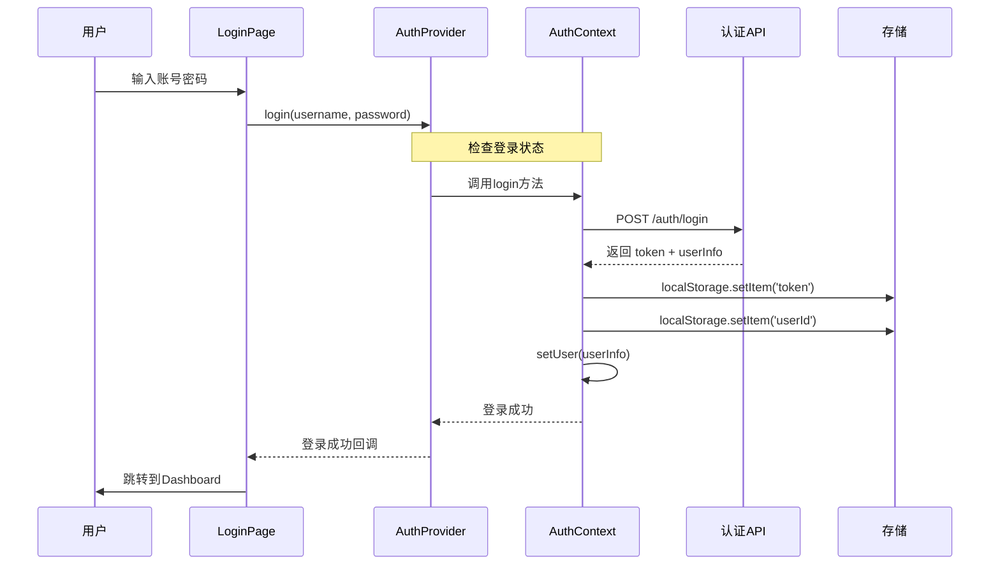
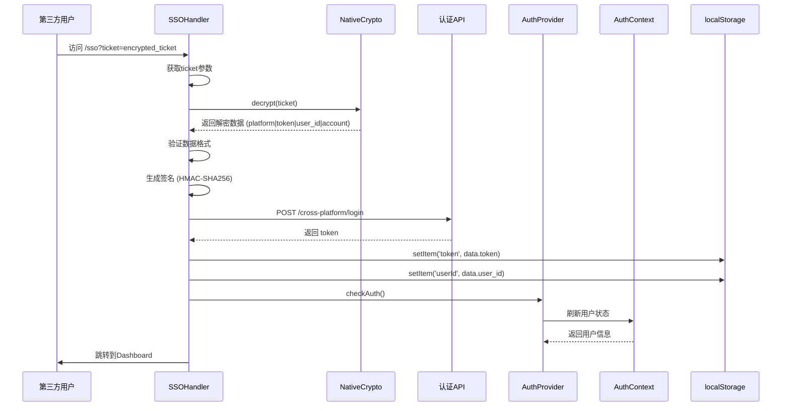
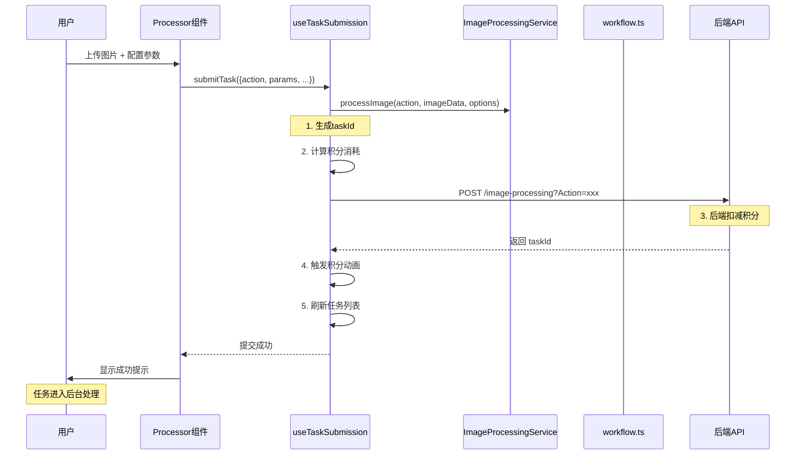
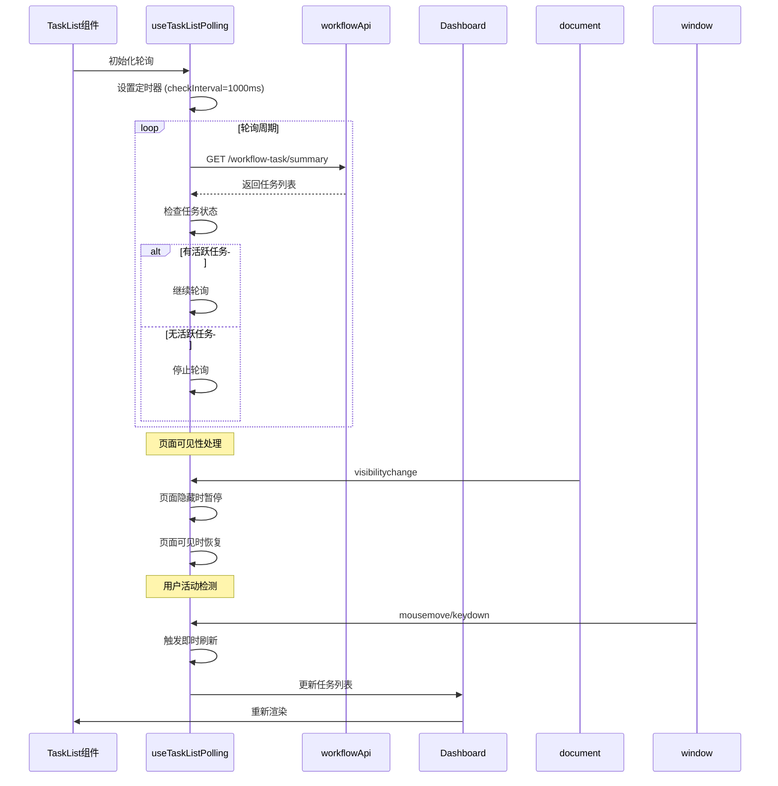
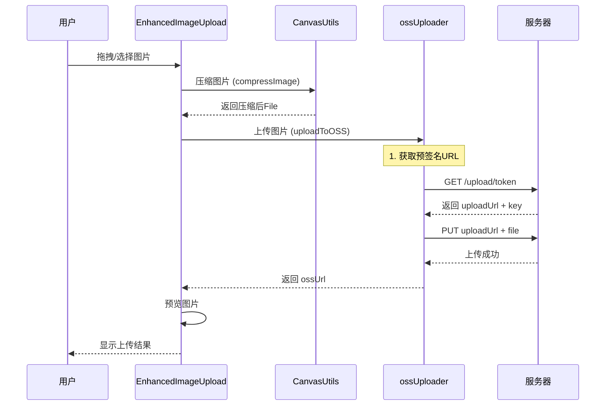

# POD AI Studio 组件交互与数据流

## 目录

1. [组件关系总览](#1-组件关系总览)
2. [核心交互流程](#2-核心交互流程)
3. [数据流分析](#3-数据流分析)
4. [状态管理](#4-状态管理)
5. [错误处理流程](#5-错误处理流程)

---

## 1. 组件关系总览

### 1.1 前端组件树

```
App.tsx
├── AuthProvider (认证上下文)
│   └── AuthContext
│       ├── LoginPage (登录页)
│       └── RegisterPage (注册页)
│
├── NotificationProvider (通知上下文)
│   └── Toaster (全局提示)
│
├── PointsProvider (积分上下文)
│   └── PointsContext
│       ├── PointsHistoryPage (积分记录)
│       └── Header (顶部栏积分显示)
│
├── SidebarProvider (侧边栏上下文)
│   └── Sidebar (侧边栏)
│       ├── Dashboard (仪表板)
│       ├── PersonalCenter (个人中心)
│       ├── PersonalGallery (个人图库)
│       └── AI Tools (AI工具)
│           ├── AIToolsLayout
│           │   ├── LosslessUpscaleProcessor (无损放大)
│           │   ├── PatternExtractProcessor (印花提取)
│           │   ├── SeamlessProcessor (四方连续)
│           │   ├── ExtensionProcessor (图片扩展)
│           │   ├── FissionProcessor (图裂变)
│           │   └── AIImageEditorPage (AI编辑器)
│           └── AIToolsPage (工具选择页)
│
├── BatchTaskDashboardPage (任务仪表板)
│   └── TaskDetailPage (任务详情)
│
└── SSOHandler (SSO处理)
```

### 1.2 核心组件依赖关系

```
                    ┌─────────────────┐
                    │     App.tsx     │
                    └────────┬────────┘
                             │
              ┌──────────────┼──────────────┐
              ▼              ▼              ▼
     ┌────────────────┐ ┌───────────┐ ┌──────────────┐
     │ AuthProvider   │ │ PointsProv│ │ SidebarProv  │
     └───────┬────────┘ └─────┬─────┘ └──────┬───────┘
             │                │               │
             ▼                ▼               ▼
     ┌────────────────┐ ┌───────────┐ ┌──────────────┐
     │ AuthContext    │ │ PointsCtx │ │ Sidebar      │
     │ ├─login()      │ │ ├─balance │ │ └─Header     │
     │ ├─logout()     │ │ ├─consume │ │    └─user    │
     │ └─checkAuth()  │ │ └─history │ │              │
     └────────┬───────┘ └─────┬─────┘ └──────┬───────┘
              │                │               │
              ▼                │               ▼
     ┌────────────────┐        │      ┌──────────────┐
     │ LoginPage      │        │      │ AI Tools     │
     │ RegisterPage   │        │      │ ├─Hires      │
     │ SSOHandler     │        │      │ ├─Pattern    │
     └────────┬───────┘        │      │ ├─Seamless   │
              │                │      │ └─...        │
              └────────────────┴──────┴──────────────┘
```

---

## 2. 核心交互流程

### 2.1 用户登录流程



### 2.2 第三方SSO登录流程



### 2.3 任务提交流程



### 2.4 任务状态轮询流程



### 2.5 图片上传流程



---

## 3. 数据流分析

### 3.1 任务数据流

```
┌──────────────────────────────────────────────────────────────────┐
│                        任务数据流                                  │
├──────────────────────────────────────────────────────────────────┤
│                                                                   │
│   用户操作              组件状态            服务层               │
│                                                                   │
│   ┌────────┐           ┌────────┐        ┌─────────────────┐   │
│   │ 上传图片│──────────▶│uploaded│───────▶│ ImageProcessing │   │
│   └────────┘           │ Images │        │   Service       │
│                        └────────┘        └────────┬────────┘
│                                                   │
│   ┌────────┐           ┌────────┐                │
│   │ 配置参数│──────────▶│ params │                │
│   └────────┘           └────────┘                │
│                                                   │
│   ┌────────┐           ┌────────┐        ┌────────▼────────┐   │
│   │ 提交任务│──────────▶│ taskId │──────▶│ submitImageProc │   │
│   └────────┘           └────────┘        │    essingTask   │
│                                          └────────┬────────┘
│                                                   │
│                                          ┌────────▼────────┐   │
│                                          │   workflow.ts   │   │
│                                          └────────┬────────┘   │
│                                                   │            │
│                                          ┌────────▼────────┐   │
│                                          │   http.post()   │   │
│                                          └─────────────────┘   │
│                                                                   │
└──────────────────────────────────────────────────────────────────┘
```

### 3.2 积分数据流

```
┌──────────────────────────────────────────────────────────────────┐
│                        积分数据流                                  │
├──────────────────────────────────────────────────────────────────┤
│                                                                   │
│   ┌──────────┐         ┌────────────┐         ┌───────────────┐ │
│   │ 用户发起  │ ──────▶│ PointsCtx  │ ──────▶ │ pointsAPI     │ │
│   │ 任务请求  │         │            │         │               │ │
│   └──────────┘         └─────┬──────┘         └───────┬───────┘ │
│                              │                        │         │
│                              ▼                        │         │
│                       ┌────────────┐                  │         │
│                       │ 校验积分   │                  │         │
│                       │ 余额是否   │                  │         │
│                       │ 足够      │                  │         │
│                       └─────┬──────┘                  │         │
│                             │                         │         │
│              ┌──────────────┴──────────────┐          │         │
│              ▼                              ▼          │         │
│       ┌────────────┐               ┌────────────┐     │         │
│       │ 积分不足   │               │ 积分足够   │     │         │
│       │ 阻止提交   │               │ 预扣积分   │─────┼─────────┤
│       └────────────┘               └─────┬──────┘     │         │
│                                          │            │         │
│                                          ▼            │         │
│                                   ┌────────────┐      │         │
│                                   │ 触发动画   │◀─────┼─────────┤
│                                   │ 数值滚动   │      │         │
│                                   └────────────┘      │         │
│                                          │            │         │
│                                          ▼            │         │
│                                   ┌────────────┐      │         │
│                                   │ 提交成功   │      │         │
│                                   │ 通知后端   │──────┼─────────┘
│                                   └────────────┘      │
│                                          │            │
│                                          ▼            │
│                                   ┌────────────┐      │
│                                   │ 任务完成   │──────┘
│                                   │ 实际扣减   │   (任务成功)
│                                   └────────────┘      │
│                                          │            │
│                                          ▼            │
│                                   ┌────────────┐      │
│                                   │ 任务失败   │──────┘
│                                   │ 积分回滚   │   (任务失败)
│                                   └────────────┘      │
│                                                                   │
└──────────────────────────────────────────────────────────────────┘
```

---

## 4. 状态管理

### 4.1 Context 状态树

```typescript
interface AppState {
  // 认证状态
  auth: {
    user: User | null;
    isLoading: boolean;
    isAuthenticated: boolean;
  };

  // 积分状态
  points: {
    balance: number;
    frozen: number;
    statistics: PointsStatistics | null;
    transactions: Transaction[];
    isLoading: boolean;
  };

  // 通知状态
  notifications: {
    toasts: Toast[];
    notifications: Notification[];
  };

  // UI状态
  ui: {
    sidebarCollapsed: boolean;
    darkMode: boolean;
    currentPage: string;
  };
}
```

### 4.2 组件内部状态

```typescript
// AIProcessorWithTasks 组件状态
interface ProcessorState {
  // 图片状态
  uploadedImages: ImageData[];
  previewImages: ImageData[];

  // 任务状态
  activeTasks: Task[];
  completedTasks: Task[];
  isPolling: boolean;

  // UI状态
  isSubmitting: boolean;
  showSuccessDialog: boolean;
  error: string | null;

  // 参数状态
  params: ProcessorParams;
}
```

### 4.3 状态持久化

```typescript
// 需要持久化的状态
const PERSISTED_STATES = {
  'theme': 'light' | 'dark',
  'sidebar-collapsed': '0' | '1',
  'token': 'jwt_token',
  'userId': 'user_id',
  'platform': 'platform_name',
};

// 敏感信息（不清除）
const SENSITIVE_STATES = {
  'token',
  'userId',
};

// 登出时清除
const LOGOUT_CLEAR_STATES = {
  'token',
  'userId',
  'X-User-Id',
  'platform',
};
```

---

## 5. 错误处理流程

### 5.1 错误处理层级

```
┌──────────────────────────────────────────────────────────────────┐
│                        错误处理层级                                │
├──────────────────────────────────────────────────────────────────┤
│                                                                   │
│   Layer 1: HTTP拦截器                                             │
│   ┌─────────────────────────────────────────────────────────┐   │
│   │ http.interceptors.response                              │   │
│   │  - 401: 清除认证信息 → 跳转登录页                        │   │
│   │  - 403: 显示无权限提示                                   │   │
│   │  - 500: 显示服务器错误                                   │   │
│   └─────────────────────────────────────────────────────────┘   │
│                                                                   │
│   Layer 2: API服务层                                              │
│   ┌─────────────────────────────────────────────────────────┐   │
│   │ pointsAPI / workflowApi                                  │   │
│   │  - 捕获请求错误                                           │   │
│   │  - 添加友好错误信息                                       │   │
│   │  - 记录错误日志                                           │   │
│   └─────────────────────────────────────────────────────────┘   │
│                                                                   │
│   Layer 3: Hook层                                                │
│   ┌─────────────────────────────────────────────────────────┐   │
│   │ useTaskSubmission / useTaskListPolling                   │   │
│   │  - 处理提交错误                                           │   │
│   │  - 处理轮询错误                                           │   │
│   │  - 触发重试机制                                           │   │
│   └─────────────────────────────────────────────────────────┘   │
│                                                                   │
│   Layer 4: 组件层                                                │
│   ┌─────────────────────────────────────────────────────────┐   │
│   │ AIProcessorWithTasks / DashboardTaskList                 │   │
│   │  - 显示错误提示                                           │   │
│   │  - 提供重试按钮                                           │   │
│   │  - 更新任务状态                                           │   │
│   └─────────────────────────────────────────────────────────┘   │
│                                                                   │
│   Layer 5: 全局错误边界                                           │
│   ┌─────────────────────────────────────────────────────────┐   │
│   │ ErrorBoundary                                           │   │
│   │  - 捕获未处理异常                                        │   │
│   │  - 显示错误页面                                          │   │
│   │  - 上报错误信息                                          │   │
│   └─────────────────────────────────────────────────────────┘   │
│                                                                   │
└──────────────────────────────────────────────────────────────────┘
```

### 5.2 错误码处理

```typescript
// 错误码映射
const ERROR_MESSAGES: Record<string, string> = {
  'AUTH_TOKEN_EXPIRED': '登录已过期，请重新登录',
  'AUTH_TOKEN_INVALID': '登录信息无效，请重新登录',
  'POINTS_INSUFFICIENT': '积分不足，请充值',
  'POINTS_FROZEN': '积分已被冻结，请联系客服',
  'TASK_NOT_FOUND': '任务不存在',
  'TASK_PROCESSING': '任务正在处理中',
  'TASK_FAILED': '任务处理失败',
  'IMAGE_UPLOAD_FAILED': '图片上传失败',
  'IMAGE_SIZE_EXCEEDED': '图片大小超出限制',
  'IMAGE_FORMAT_INVALID': '图片格式不支持',
  'API_RATE_LIMITED': '请求过于频繁，请稍后重试',
  'API_KEY_INVALID': '服务配置错误，请联系管理员',
  'SERVER_ERROR': '服务器错误，请稍后重试',
};
```

---

## 附录：文件位置索引

```
src/
├── App.tsx                    # 应用入口 + 路由配置
├── contexts/
│   ├── AuthContext.tsx        # 认证上下文定义
│   ├── AuthProvider.tsx       # 认证提供者实现
│   └── PointsContext.tsx      # 积分上下文实现
├── hooks/
│   ├── useTaskListPolling.ts  # 任务轮询Hook
│   └── useTaskSubmission.ts   # 任务提交Hook
├── services/
│   ├── http.ts               # HTTP客户端
│   ├── pointsAPI.ts          # 积分API
│   └── workflowApi.ts        # 工作流API
├── utils/
│   ├── http.ts               # HTTP工具函数
│   └── workflow.ts           # 工作流工具函数
└── pages/
    ├── Login/
    │   └── LoginPage.tsx     # 登录页面
    ├── SSO/
    │   └── SSOHandler.tsx    # SSO处理页面
    └── AIProcessorTools/
        └── *.tsx             # 各AI工具处理器

docs/
├── COMPONENT_INTERACTIONS.md  # 本文档
├── BUSINESS_MODEL.md          # 业务建模文档
├── architecture.md            # 架构文档
└── api.md                     # API文档
```

---

*文档版本: 1.0.0*
*最后更新: 2024-01-06*
*维护者: POD AI Studio Team*
