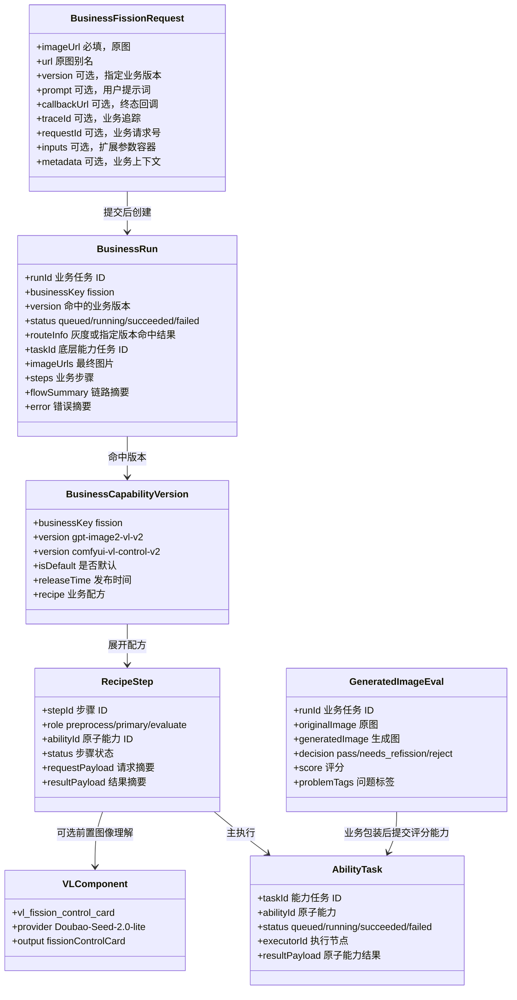
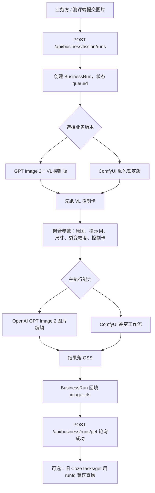
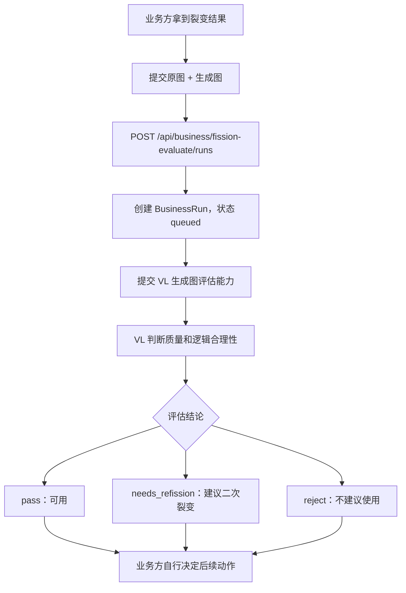

# 图裂变交付接口契约图（2026-05-12）

本文档沉淀 2026-05-12 交付给业务方的三个接口：

- 图裂变 · GPT Image 2 + VL 控制版
- 图裂变 · ComfyUI 颜色锁定版
- 生成图评估 · 裂变质量与逻辑评估

目标是避免后续再重复确认“哪个 ID 用来轮询、哪些参数被统一聚合、`bili` 到底表示什么”。

---

## 1. 排队与轮询结论

结论：**新业务接口和旧 Coze 工具箱在业务机制上是一致的，都是“提交任务 -> 返回 ID -> 轮询结果”。**

差异只在字段名和承载层：

| 入口 | 提交后主 ID | 轮询接口 | 状态字段 | 成功结果字段 | 说明 |
| --- | --- | --- | --- | --- | --- |
| 旧 Coze 工具箱 | `taskId` | `POST /api/coze/podi/tasks/get` | `taskStatus` | `imageUrls/videoUrls/texts` | Coze 继续使用的兼容入口。 |
| 中台业务 API | `runId` | `POST /api/business/runs/get` | `status` | `imageUrls/videoUrls/texts` | 业务方优先使用的新入口。 |
| 中台业务 API 兼容 Coze 轮询 | `runId` | `POST /api/coze/podi/tasks/get`，把 `runId` 填到 `taskId` | `taskStatus` | `imageUrls/videoUrls/texts` | 用于不想改旧轮询逻辑的业务方或 Coze 工具箱。 |
| 中台业务 API 裂变评分 | `runId` | `POST /api/business/runs/get` | `status` | `resultPayload/texts/flowSummary.output` | 推荐给业务方使用的新入口，统一业务 Key 和轮询方式。 |

状态含义：

| 状态 | 业务含义 | 调用方动作 |
| --- | --- | --- |
| `queued` | 已接收，等待调度或等待前置步骤完成。 | 继续轮询。 |
| `running` | 已下发到底层能力或正在等待回填。 | 继续轮询。 |
| `succeeded` | 任务成功，结果已可读。 | 读取 `imageUrls/videoUrls/texts/resultPayload`。 |
| `failed` | 任务失败。 | 读取 `error/errorMessage/debugResponse`，记录 `runId/taskId/traceId` 排查。 |
| `cancelled` | 业务任务被取消。 | 不再轮询，按失败或取消处理。 |

硬规则：

- 外部业务默认使用 `/api/business/runs/get`。
- Coze 或旧业务轮询不想改时，可以把 `runId` 填入 `/api/coze/podi/tasks/get` 的 `taskId`。
- 底层 `taskId` 是能力任务 ID，只用于排障关联，不要求业务方理解。
- 业务接口多了一层 `BusinessRun`，负责版本、灰度、步骤、回调、计费和排障证据；这层不改变“排队轮询”的外部模式。

---

## 2. 类图关系



---

## 3. 业务流图

### 3.1 两个裂变接口



### 3.2 生成图评估接口



注意：评分接口只做判断，不在中台里自动二次裂变。业务方如果要“评分不通过就再裂变”，应在自己的业务逻辑里重新调用图裂变接口。

---

## 4. 参数统一聚合规则

业务层会把顶层参数、`inputs` 参数、VL 结果和版本默认值聚合成底层能力入参。规则如下：

| 优先级 | 来源 | 规则 |
| --- | --- | --- |
| 1 | `inputs` 内已有字段 | 优先保留，不主动覆盖。 |
| 2 | 顶层字段 | 如果 `inputs` 里没有同名字段，复制进 `inputs`。 |
| 3 | 顶层 `prompt` | 如果 `inputs.prompt` 为空，复制为底层提示词。 |
| 4 | VL 编译结果 | 默认只补空字段；除非配方明确配置覆盖，否则不覆盖用户已传字段。 |
| 5 | 能力默认值 | 底层能力按自己的默认值补齐，例如尺寸、质量、输出格式。 |

当前图裂变允许透传的核心字段：

| 字段 | 适用版本 | 含义 | 备注 |
| --- | --- | --- | --- |
| `imageUrl` / `url` | 两个裂变版本 | 原图 URL | 必填。上传后默认取上传图地址。 |
| `prompt` | 两个裂变版本 | 用户提示词 | 可选；不传时由系统提示词和 VL 结果兜底。 |
| `bili` | ComfyUI 颜色锁定版 | 裂变幅度 / 重绘幅度 | 不是相似度。建议 0%-20%，默认 15%。 |
| `width` / `height` | ComfyUI 颜色锁定版 | 输出宽高 | 默认应跟原图尺寸走；用户可以手动改。 |
| `profile` / `profile_id` | ComfyUI 颜色锁定版 | 裂变配置 | 默认 `pattern_color_lock_v2`。 |
| `variation_strength` | GPT Image 2 + VL 控制版 | 商业模型裂变强度 | 建议值：`conservative/same_series/creative_same_series`。 |
| `quality` | GPT Image 2 + VL 控制版 | 输出质量 | 走 OpenAI 图片编辑参数。 |
| `size` | GPT Image 2 + VL 控制版 | 输出尺寸 | 默认 `auto`，最终 OSS 图片按原图尺寸回填；只有明确传固定预设时才改变画布。 |
| `maskUrl` / `mask_url` | GPT Image 2 + VL 控制版 | 蒙版图 URL | 可选；有蒙版编辑需求时传。 |

`bili` 口径必须统一：

- `bili` = 裂变幅度 / 重绘幅度。
- 不是“相似度”。
- 数值越大，重绘越强，和原图差异越大。
- ComfyUI 颜色锁定版使用 `variation_percent_045_080_colorlock_v2` 映射，内部大致对应 denoise 0.45 到 0.80；业务侧建议限制在 0%-20%。
- 旧裂变工作流继续沿用之前约定，不再反向改成“相似度”。

---

## 5. 三个交付接口口径

### 5.1 GPT Image 2 + VL 控制版

推荐提交：

```json
{
  "imageUrl": "https://example.com/input.png",
  "version": "gpt-image2-vl-v2",
  "prompt": "可选：希望保留主体结构，生成同系列花纹裂变",
  "inputs": {
    "variation_strength": "same_series",
    "quality": "preview",
    "size": "auto"
  },
  "traceId": "biz_trace_001",
  "requestId": "biz_req_001"
}
```

关键点：

- 这个版本不走 Coze 工作流，走中台业务 API。
- 先跑 VL 控制卡，再编译 GPT Image 2 图片编辑提示词。
- `prompt` 可选，不传也会有默认系统提示词和 VL 分析兜底。
- 有蒙版时传 `maskUrl`。
- 固定单次输出 1 张图；如需 3 张，提交 3 次，每次获得独立 `runId`、轮询结果和回调。

### 5.2 ComfyUI 颜色锁定版

推荐提交：

```json
{
  "imageUrl": "https://example.com/input.png",
  "version": "comfyui-vl-control-v2",
  "inputs": {
    "bili": "15%",
    "width": 2000,
    "height": 2000,
    "profile": "pattern_color_lock_v2"
  },
  "traceId": "biz_trace_002",
  "requestId": "biz_req_002"
}
```

关键点：

- 这个版本不走 Coze 工作流，走中台业务 API。
- 宽高默认应由上传原图读取；业务方可以手动覆盖。
- `bili` 是裂变幅度，不是相似度；颜色锁定版建议 0%-20%，默认 15%。
- `profile` 默认 `pattern_color_lock_v2`；更严格保色时可用 `pattern_color_lock_strict_v2`。
- 底层会路由到可用 ComfyUI 服务器，不能固定打一台机器。

### 5.3 生成图评估

推荐提交语义：

```json
{
  "originalImageUrl": "https://example.com/input.png",
  "generatedImageUrl": "https://example.com/output.png",
  "context": {
    "business": "fission",
    "version": "gpt-image2-vl-v2",
    "prompt": "本次裂变目标"
  },
  "traceId": "biz_trace_score_001",
  "requestId": "biz_req_score_001"
}
```

关键点：

- 这是单独的能力，不等于裂变接口的一部分。
- 对外入口是 `POST /api/business/fission-evaluate/runs`，返回 `runId` 后继续用 `POST /api/business/runs/get` 轮询。
- 输出重点是 `decision`、`score`、`problemTags` 和 `reason`。
- 业务方根据结论自行决定是否再次调用裂变接口。

---

## 6. 维护规则

以后修改图裂变相关参数时，必须同步检查以下位置：

| 内容 | 必改位置 |
| --- | --- |
| 业务方入参、轮询方式、状态字段 | 本文档、`docs/api/modules/business.md`、交付包 README |
| `bili`、宽高、尺寸预设、蒙版等表单文案 | 测评端、管理端、本文档 |
| 业务版本、默认版本、灰度规则 | 管理端业务能力页、`docs/api/modules/business.md` |
| VL 组件或模型变更 | `vl_fission_control_card` 能力定义、业务配方、本文档 |
| 评分接口对外方式变更 | 本文档、评测端、业务 API 文档 |

最低约束：

- 不允许再把 `bili` 写成“相似度”。
- 不允许新增裂变版本但不写明是否走 Coze。
- 不允许只改前端表单，不同步业务 API 示例。
- 不允许只看底层能力参数，不看业务层的参数聚合规则。
