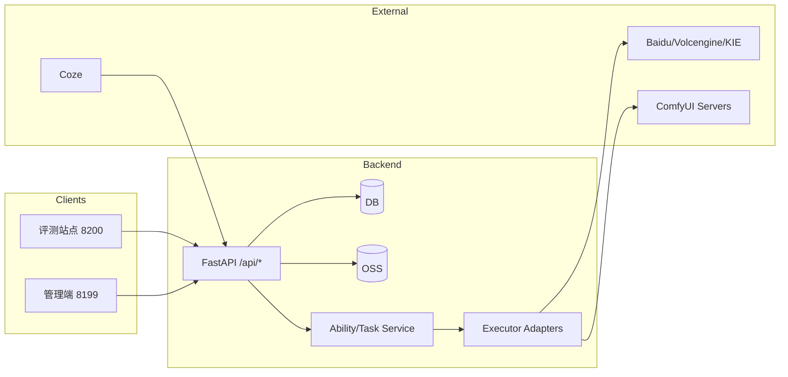

# PODI 平台架构与边界（总览）

> 版本：2026-02-03  
> 目的：先明确整体边界与核心契约，再细化各平台子功能。强调“抽象与解耦”，避免因业务变化频繁返工。

## 1. 系统总览

PODI 由三部分组成：

- **后端（FastAPI + Celery）**：统一能力 API、任务调度、媒资落盘、日志与回调。
- **管理端（podi-admin-web）**：执行节点/能力/工作流配置、能力测试、日志与成本。
- **评测站点（podi-eval-web）**：Coze 工作流评测、回归验证、文档与结果可视化。

核心目标：  
**能力定义与执行解耦**，**能力执行与展示解耦**，**评测链路与生产链路解耦**。



## 2. 平台边界与职责

### 2.1 后端（业务中台）
- **能力执行**：`/api/abilities`、`/api/abilities/{id}/invoke`
- **任务调度**：`/api/ability-tasks`、异步回调、轮询查询
- **媒资落盘**：任何外链/上游输出统一落 OSS
- **日志与成本**：`ability_invocation_logs`、可追溯/可审计

### 2.2 管理端（配置与管理）
- **执行节点**：多机器 ComfyUI / 商业模型的注册与状态查看
- **能力管理**：输入 schema、默认参数、metadata（api_type/模型等）
- **能力测试**：统一入口，输出日志/结果/预览
- **工作流/绑定**：ComfyUI 工作流与能力绑定管理

### 2.3 评测站点（评测与回归）
- **工作流评测**：调用 Coze workflow；收集结果/回调
- **文档生成**：从 DB 自动生成入参/出参/备注
- **回归验证**：新版本上线前的评测入口

### 2.4 Coze（外部集成）
- **工具箱调用**：`/api/coze/podi/tools/*`
- **任务回调/查询**：`/api/coze/podi/tasks/get`
- **队列状态**：`/api/coze/podi/comfyui/queue-summary`

## 3. 核心抽象与解耦（必须遵守）

### 3.1 Ability（能力定义）
- 定义在 `backend/app/constants/abilities.py`
- 必须包含：`defaults`、`input_schema`、`metadata.api_type`
- **能力定义与执行节点解耦**：能力不直接绑定机器

### 3.2 Executor（执行节点）
- 定义在 `config/executors.yaml`
- 负责：`baseUrl`、`apiKey`、并发、权重
- **执行节点可替换**，能力不应硬编码服务器地址

### 3.3 Workflow / Binding（工作流与绑定）
- Workflow JSON 存在于 `backend/app/workflows/comfyui/`
- Binding 将 workflow 与 ability 关联
- **workflow 只描述流程，能力只描述输入/输出**

### 3.4 Task / Log（任务与日志）
- 任务用于异步处理，日志用于追溯
- 统一写入 `ability_invocation_logs`，确保排查入口一致

### 3.5 Media Ingest（媒资落盘）
- 任何 `url/base64` 都先入 OSS
- 对外只暴露 OSS URL，避免外链失效

## 4. 核心契约（接口/参数/回调）

### 4.1 输入参数（统一约定）
- **图片输入统一用 `url`**（Coze/评测/业务一致）
- 数值输入 **禁止带 `px`**
- 需要枚举的参数必须明确 options（避免误填）

### 4.2 输出参数（统一约定）
- 直接输出类：`output = 图片 URL`
- 回调类：`output = taskId`  
  再通过 `/api/coze/podi/tasks/get` 查询结果

### 4.3 回调与轮询
- 所有异步能力都必须可查询/可回调
- `taskId` 返回格式可解析（`t1.<provider>.<executorId>.<raw>`）

### 4.4 错误与队列标准
详见 `docs/standards/queue-and-error-standards.md`

## 5. 数据流（简化）

```
调用端 → 后端能力接口 → 执行器适配 → 上游模型/ComfyUI
          ↓
       结果落 OSS → 返回 output / taskId → 回调/轮询
```

## 6. 运行约定（铁律）

- 后端：8099  
- 管理端：8199  
- 评测站点：8200  
详见 `docs/development-guide.md`

## 7. 关联文档（按层级）

### 总览
- `docs/architecture.md`（本文件）
- `docs/README.md`

### 平台子功能
- 管理端：`docs/ai-integration-management.md`
- 评测站点：`docs/ABILITY_EVALUATION.md`
- Coze：`docs/COZE_WORKFLOWS.md` / `docs/coze-plugin-podi.md`

### 运行与排查
- `docs/TROUBLESHOOTING.md`
- `docs/standards/queue-and-error-standards.md`
- `docs/standards/abstraction-and-decoupling.md`

---

> 本文件只描述“整体边界与契约”，不展开各平台子功能细节。  
> 子功能详解请在对应平台文档中更新。
