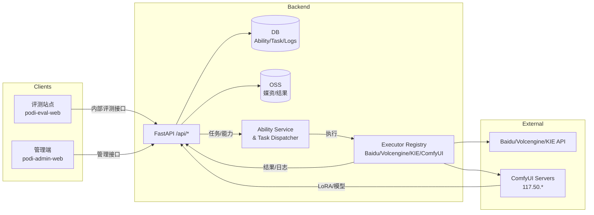
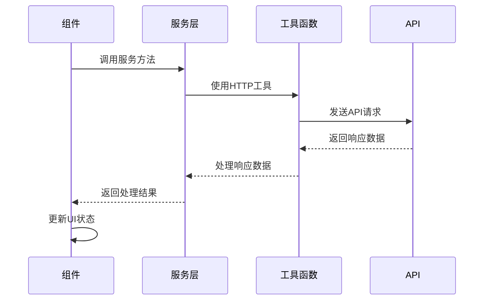
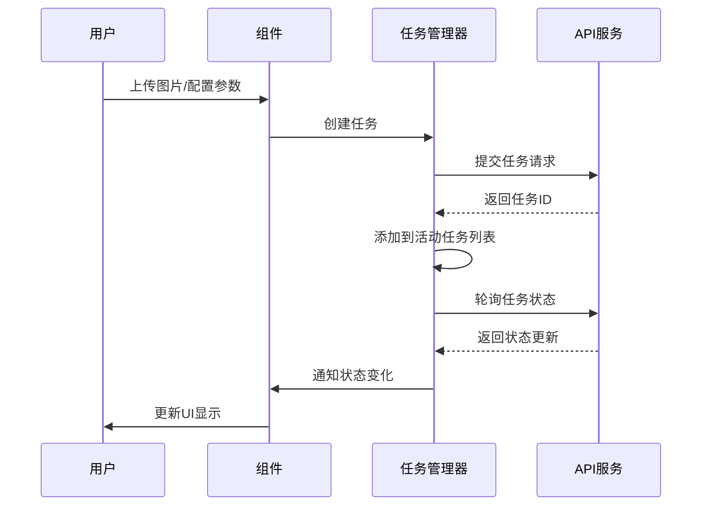
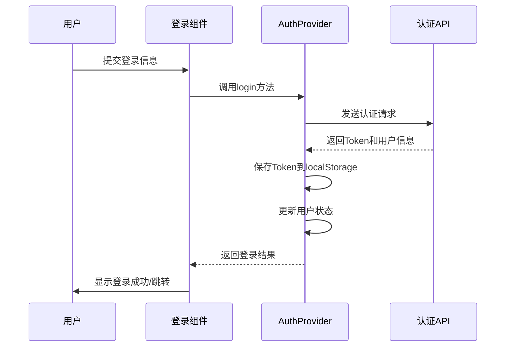

# POD AI Studio 项目架构文档

> 版本：2026-01-15。新增“原子能力中台”“统一能力 API”“ComfyUI 管理”等模块，确保前/后端结构与最近的能力治理保持一致。

## 目录

1. [系统总览](#系统总览)
2. [后端能力中台](#后端能力中台)
3. [前端技术栈](#前端技术栈)
4. [项目结构](#项目结构)
5. [核心组件](#核心组件)
6. [状态管理](#状态管理)
7. [数据流](#数据流)
8. [任务管理系统](#任务管理系统)
9. [用户认证系统](#用户认证系统)
10. [性能与可观测性](#性能与可观测性)

## 系统总览

POD AI Studio 由三部分组成：

- **评测站点（podi-eval-web）**：内部“能力评测”与回归验证（跑 Coze 工作流、看结果/打分）。
- **管理端（podi-admin-web）**：供运营/研发配置执行节点、工作流、API Key、能力测试/日志/成本。
- **后端（FastAPI + Celery）**：统一提供认证、媒资上传、任务调度、原子能力、工作流、日志、成本、自检接口。



## 后端能力中台

### 关键模块

| 模块 | 说明 |
| --- | --- |
| `FastAPI` | 所有公开/管理接口的宿主。`app/routers` 覆盖 `auth/media/tasks/abilities/admin_*` 等领域。 |
| `AbilityService` | `POST /api/abilities/{id}/invoke` & `POST /api/ability-tasks`：加载 `app/constants/abilities.py`，匹配默认执行节点（`executors` 表），并写入 `ability_invocation_logs`。 |
| `AbilityTaskService` | 负责异步任务：后台线程池（`ABILITY_TASK_MAX_WORKERS`）+ executor `max_concurrency` 控制并发。支持回调、超时、重试（后续增加）。 |
| `Executor Registry` | `app/services/executors/` 下的适配器：Baidu/Volcengine/KIE 通过 HTTP API，ComfyUI 通过 `/prompt` + `/queue/status`。每个 executor 在 `config/executors.yaml` 中声明 id/baseUrl/API Key（现改为环境变量占位）。 |
| `Workflow/Binding Seeds` | `workflow_seed.py`、`ability_seed.py` 把 JSON/YAML 写入 DB，确保四方连续 / 印花提取等 workflow、能力、绑定在新环境一键落库。 |
| `MediaIngestService` | 将第三方 URL 或 ComfyUI 输出下载后上传至 OSS，并返回 `storedUrl` 供客户端/管理端展示。 |
| `AbilityLogService` | 将 `request_id/executor_id/duration_ms/pricing/cost_amount/assets/raw/error` 写入 `ability_invocation_logs`，同时提供 `/api/admin/abilities/{id}/logs` 查询。 |

### 统一能力 API & 成本

- `GET /api/abilities`：激活能力列表，字段包含 provider、`abilityType`、能力 Schema、`metadata.pricing`（币种/单位/对外价/折扣价）、健康状态（最近巡检结果、成功率等占位）。
- `POST /api/abilities/{abilityId}/invoke`：同步调用，必须登录（Bearer Token）。支持 `inputs`（与 schema 对应）、`imageUrl/imageBase64/images[]`、`executorId` 覆盖、`metadata.traceId`、`callbackUrl`。响应包含 `logId`, `durationMs`, `assets`, `raw`。
- `POST /api/ability-tasks`：异步入口，返回 `taskId`，可 `GET /api/ability-tasks/{taskId}` 或等待回调。任务记录 `requestPayload/resultPayload/errorMessage/duration`.
- 成本：若能力 metadata 配置 `pricing`，日志会写入 `list_price/discount_price/cost_amount`；未配置则使用默认值（目前 ComfyUI ¥0.30/张）。管理端概览与调用记录均展示成本字段，便于预算估算。
- 自检：`IntegrationTestService` 已可复用（手动），下一步将在定时任务中巡检并更新 `lastHealthStatus/lastHealthCheckAt`。

### ComfyUI 管理

- Workflow JSON: `backend/app/workflows/comfyui/sifang_lianxu.json`、`yinhua_tiqu.json`。文档 `docs/comfyui/README.md` 记录节点、LoRA、默认参数、变更历史。
- 执行节点：`config/executors.yaml` 中的 `executor_comfyui_*`，`config.apiKey/baseUrl` 改用环境变量占位；`ensure_default_executors` 写入 DB。
- `/api/admin/comfyui/models`: 代理 `/object_info`，解析 UNet/CLIP/VAE/LoRA 选项，管理端测试表单自动渲染下拉，并允许“手动输入”回退。
- `/api/admin/comfyui/queue-status`: 代理 `/queue/status`，返回 `running/pending/max`。若 ComfyUI 离线则抛 `COMFYUI_QUEUE_STATUS_ERROR`，管理端会提示“服务器不可达”。
- 输出处理：ComfyUI 返回的 `file_name/subfolder/type` 会拼接 `{baseUrl}/view` 下载，再经 `media_ingest_service` 落 OSS，确保统一 URL。

## 前端技术栈

### 核心框架与库

| 技术 | 版本 | 用途 |
|------|------|------|
| React | 18.3.1 | UI框架，提供组件化开发能力 |
| TypeScript | 5.x | 类型系统，提高代码质量和开发体验 |
| Vite | 6.3.5 | 构建工具，提供快速的开发体验 |

### UI组件与样式

| 技术 | 版本 | 用途 |
|------|------|------|
| Radix UI | - | 无样式、可访问的UI组件基础 |
| Tailwind CSS | - | 实用优先的CSS框架 |
| Lucide React | 0.487.0 | 图标库 |

### 状态管理与数据处理

| 技术 | 版本 | 用途 |
|------|------|------|
| React Context | - | 轻量级状态管理 |
| React Hook Form | 7.55.0 | 表单状态管理 |
| 自定义HTTP工具 | - | API请求封装 |

## 项目结构

```
podi-design-web/
├── public/                    # 静态资源（静态 HTML / icons / 公共文件）
│   └── test-polling.html
├── build/                     # 生产构建输出（由 `npm run build` 生成）
│   ├── index.html
│   └── assets/
├── docs/                      # 项目文档
│   ├── api.md
│   ├── architecture.md
│   ├── development-guide.md
│   └── ...
├── src/                       # 源代码（主要开发目录）
│   ├── App.tsx
│   ├── main.tsx
│   ├── index.css
│   ├── assets/                # 静态图片与资源
│   │   └── images/
│   ├── components/            # 复用组件与 UI 组件
│   │   ├── EnhancedImageUpload.tsx
│   │   ├── GalleryManager.tsx
│   │   ├── ImageCarousel.tsx
│   │   └── ui/                # 基础 UI 组件集合（Button, Card, Dialog 等）
│   ├── pages/                 # 页面级组件（按功能目录组织）
│   │   ├── AIImageEditor/            # AI 编辑器页面
│   │   │   └── AIImageEditorPage.tsx
│   │   ├── AIProcessorTools/         # 各类 AI 工具与处理器（Upscale, Seamless, Pattern 等）
│   │   │   ├── LosslessUpscaleProcessor.tsx
│   │   │   ├── PatternExtractProcessor.tsx
│   │   │   └── SeamlessProcessor.tsx
│   │   ├── AIToolsPage/              # AI 工具入口页面
│   │   │   └── AIToolsPage.tsx
│   │   ├── AIToolsLayout/            # AI 工具布局容器
│   │   │   └── AIToolsLayout.tsx
│   │   ├── BatchTaskDashboard/       # 批量任务仪表盘（重命名/增强后的 Dashboard）
│   │   │   ├── BatchTaskDashboardPage.tsx
│   │   │   ├── BatchTaskCard.tsx
│   │   │   └── BatchTaskFilterBar.tsx
│   │   ├── Header/                   # 头部与全局小组件
│   │   │   └── Header.tsx
│   │   ├── Login/                    # 登录页面
│   │   │   └── LoginPage.tsx
│   │   ├── PersonalCenter/           # 个人中心
│   │   │   └── PersonalCenterPage.tsx
│   │   ├── PersonalGallery/          # 个人图库（网格/列表/预览/批量操作）
│   │   │   ├── PersonalGalleryPage.tsx
│   │   │   ├── GalleryToolbar.tsx
│   │   │   └── ImageCard.tsx
│   │   ├── PointsHistory/            # 积分/余额相关页面
│   │   │   └── PointsHistoryPage.tsx
│   │   ├── Register/                 # 注册页面
│   │   │   └── RegisterPage.tsx
│   │   ├── Sidebar/                  # 侧边栏与导航
│   │   │   └── Sidebar.tsx
│   │   ├── SSO/                      # 单点登录处理
│   │   │   └── SSOHandler.tsx
│   │   └── TaskDetail/               # 任务详情与结果查看
│   │       └── TaskDetailPage.tsx
│   ├── contexts/              # React Context 提供者（Auth, Notifications, Points 等）
│   ├── hooks/                 # 自定义 Hooks（useGalleryData, useTaskPolling 等）
│   ├── services/              # 后端 API 封装（http.ts, image service, points api 等）
│   ├── constants/             # 常量集合（gallery, task, image, sidebar 等）
│   ├── styles/                # 全局与原子样式文件
│   └── types/                 # TypeScript 类型定义
├── package.json
├── tsconfig.json
├── vite.config.ts
└── README.md
```

## 核心组件

### 应用架构组件

#### App.tsx
应用的主入口组件，负责：
- 路由管理和页面切换
- 全局状态初始化
- 主题切换逻辑
- 认证状态管理

#### Sidebar.tsx
侧边导航组件，提供：
- 功能模块导航
- 用户状态显示
- 响应式布局适配

#### Header.tsx
顶部导航组件，包含：
- 用户信息展示
- 主题切换按钮
- 通知中心入口

#### Dashboard.tsx
仪表板组件，实现：
- 任务状态展示
- 数据统计可视化
- 快速操作入口

### AI处理工具组件

每个AI处理工具都是独立的组件，遵循统一的设计模式：

```typescript
interface ToolProcessorProps {
  action: string; // 工具类型标识
}

function ToolProcessor({ action }: ToolProcessorProps) {
  // 1. 状态管理
  const [uploadedImages, setUploadedImages] = useState<ImageData[]>([]);
  const [processingParams, setProcessingParams] = useState<Params>({});
  const [taskStatus, setTaskStatus] = useState<TaskStatus>('idle');
  
  // 2. 图片上传处理
  const handleImageUpload = (images: ImageData[]) => {
    setUploadedImages(images);
  };
  
  // 3. 参数变更处理
  const handleParamChange = (params: Params) => {
    setProcessingParams(params);
  };
  
  // 4. 任务提交处理
  const handleSubmit = async () => {
    // 提交任务到后端
  };
  
  // 5. 结果渲染
  return (
    <div>
      {/* 图片上传区域 */}
      {/* 参数配置区域 */}
      {/* 任务提交按钮 */}
      {/* 结果展示区域 */}
    </div>
  );
}
```

## 状态管理

### 认证状态管理

使用React Context管理用户认证状态：

```typescript
// AuthContext.tsx
interface AuthContextType {
  user: User | null;
  isLoading: boolean;
  login: (credentials: LoginCredentials) => Promise<void>;
  logout: () => void;
  register: (userData: RegisterData) => Promise<void>;
  checkAuth: () => Promise<void>;
}

// AuthProvider.tsx
export const AuthProvider: React.FC<{ children: React.ReactNode }> = ({ children }) => {
  const [user, setUser] = useState<User | null>(null);
  const [isLoading, setIsLoading] = useState(true);
  
  // 认证逻辑实现...
  
  return (
    <AuthContext.Provider value={{ user, isLoading, login, logout, register, checkAuth }}>
      {children}
    </AuthContext.Provider>
  );
};
```

### 任务状态管理

使用自定义Hook管理任务状态：

```typescript
// taskManager.ts
export interface Task {
  id: string;
  status: TaskStatus;
  progress: number;
  createdAt: Date;
  updatedAt: Date;
  // 其他任务属性...
}

// 任务管理Hook
export const useTaskManager = () => {
  const [tasks, setTasks] = useState<Task[]>([]);
  const [activeTasks, setActiveTasks] = useState<Set<string>>(new Set());
  
  // 任务管理逻辑...
  
  return {
    tasks,
    activeTasks,
    addTask,
    removeTask,
    updateTaskStatus,
    // 其他方法...
  };
};
```

## 数据流

### API请求流程



### 任务处理流程



## 任务管理系统

### 任务状态枚举

```typescript
export enum TaskStatus {
  PENDING = 'pending',
  PROCESSING = 'processing',
  COMPLETED = 'completed',
  FAILED = 'failed',
  CANCELED = 'canceled'
}
```

### 任务监控机制

实现了两种任务监控机制：

1. **轮询机制**：定期查询任务状态
2. **事件驱动机制**：基于页面可见性变化触发状态检查

```typescript
// taskMonitoringEventSystem.ts
export class TaskMonitoringEventSystem {
  private taskIds: Set<string> = new Set();
  private callbacks: Map<string, Function[]> = new Map();
  
  // 添加任务到监控列表
  addTask(taskId: string): void {
    this.taskIds.add(taskId);
  }
  
  // 移除任务监控
  removeTask(taskId: string): void {
    this.taskIds.delete(taskId);
  }
  
  // 注册状态变化回调
  onStatusChange(taskId: string, callback: Function): void {
    // 实现回调注册
  }
  
  // 检查所有任务状态
  async checkAllTasksStatus(): Promise<void> {
    // 实现状态检查逻辑
  }
}
```

### 任务动态集合管理

```typescript
// taskDynamicCollectionManager.ts
export class TaskDynamicCollectionManager {
  private collection: Map<string, TaskStatus> = new Map();
  
  // 添加任务
  addTask(taskId: string, status: TaskStatus): void {
    this.collection.set(taskId, status);
  }
  
  // 更新任务状态
  updateTaskStatus(taskId: string, status: TaskStatus): void {
    if (this.collection.has(taskId)) {
      this.collection.set(taskId, status);
    }
  }
  
  // 获取所有活动任务
  getActiveTasks(): string[] {
    return Array.from(this.collection.keys()).filter(
      taskId => this.collection.get(taskId) !== TaskStatus.COMPLETED
    );
  }
}
```

## 用户认证系统

### 认证流程



### Token管理

```typescript
// http.ts
const http = {
  async request<T>(config: AxiosRequestConfig): Promise<T> {
    // 添加认证头
    const token = localStorage.getItem('token');
    if (token) {
      config.headers = {
        ...config.headers,
        Authorization: `Bearer ${token}`
      };
    }
    
    try {
      const response = await axios(config);
      return response.data;
    } catch (error) {
      // 处理Token过期
      if (error.response?.status === 401) {
        // 清除Token并重定向到登录页
        localStorage.removeItem('token');
        window.location.href = '/login';
      }
      throw error;
    }
  }
};
```

## 性能与可观测性

### 前端
- **代码分割**：AI 工具、任务面板等采用 `React.lazy + Suspense` 动态加载，首屏只加载骨架 & 必需能力。
- **智能轮询**：`smart-polling` 根据页面可见性、用户活动、任务状态动态调节请求频率，避免后台页面造成无意义请求。
- **图片优化**：上传前压缩、生成缩略图，展示端使用 Intersection Observer 懒加载与 OSS WebP；长图预览使用自适应 Canvas。
- **缓存策略**：任务/能力列表写入 localStorage 并附版本号，刷新前校验，减少重复 API。

### 后端
- **并发控制**：`ABILITY_TASK_MAX_WORKERS` 控制线程池；executor `max_concurrency` 防止超量请求压垮第三方；ComfyUI 节点串行执行，通过 `/api/admin/comfyui/queue-status` 暴露实时队列。
- **日志 & tracing**：`ability_invocation_logs` 记录 `duration_ms/cost_amount/error_detail/trace_id`；`task_events` 记录状态流转。计划对接 OpenTelemetry 统一 trace。
- **成本/健康**：能力 metadata 附 `pricing`，日志写入成本；后台巡检脚本（规划中）会定期调用能力 → 更新 `lastHealthStatus`，并在管理端标红。
- **告警（规划）**：当成功率/P95 耗时/成本超阈值时触发通知；ComfyUI 队列 pending>0 超时也应报警。

### 可视化与排障
- 管理端能力详情包含“统一接口示例”“实时测试”“调用记录（含 Raw Response、OSS 链接、成本）”“队列状态面板”。
- ComfyUI 文档 `docs/comfyui/README.md` 记录 workflow 版本、节点编号、默认 LoRA，方便排错。
- 前后端将接入 Sentry/Prometheus（TODO）以捕获异常 & 暴露指标。

---

本架构文档将随着项目的发展持续更新，确保反映最新的技术决策和实现细节。
