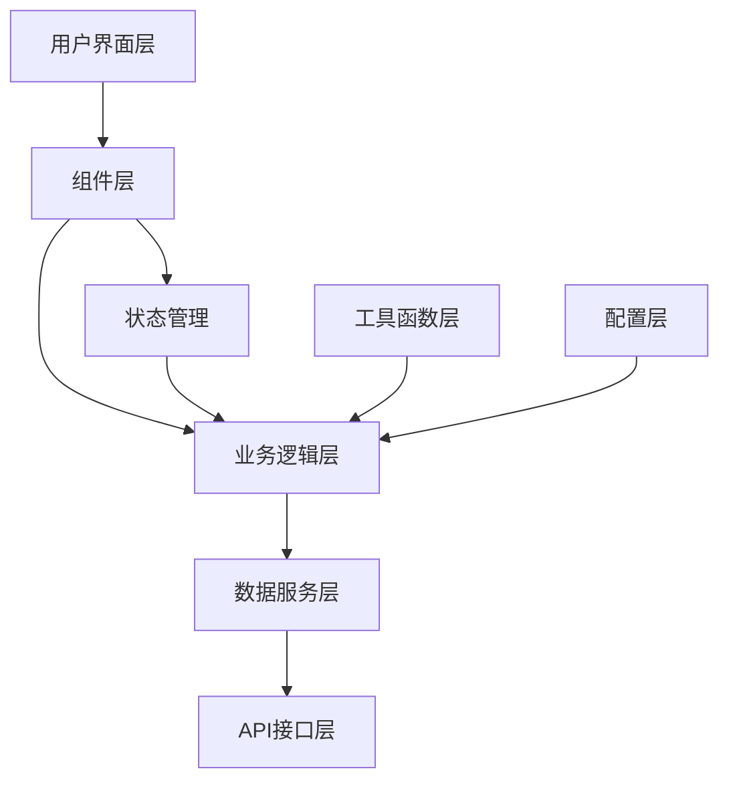
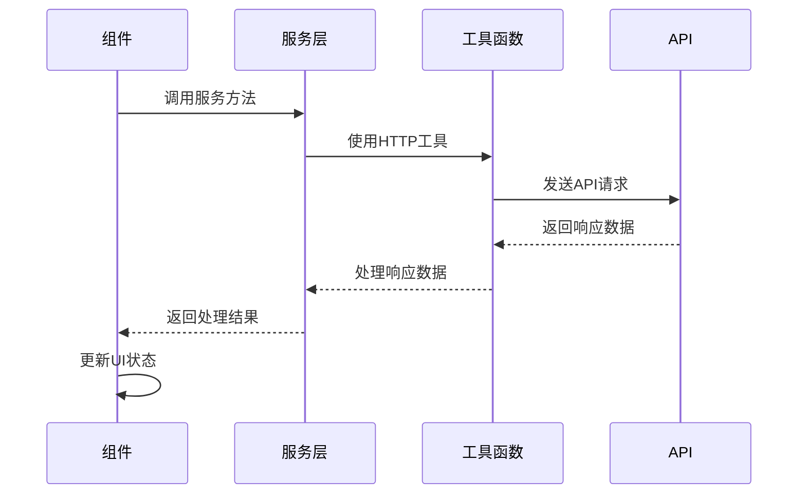
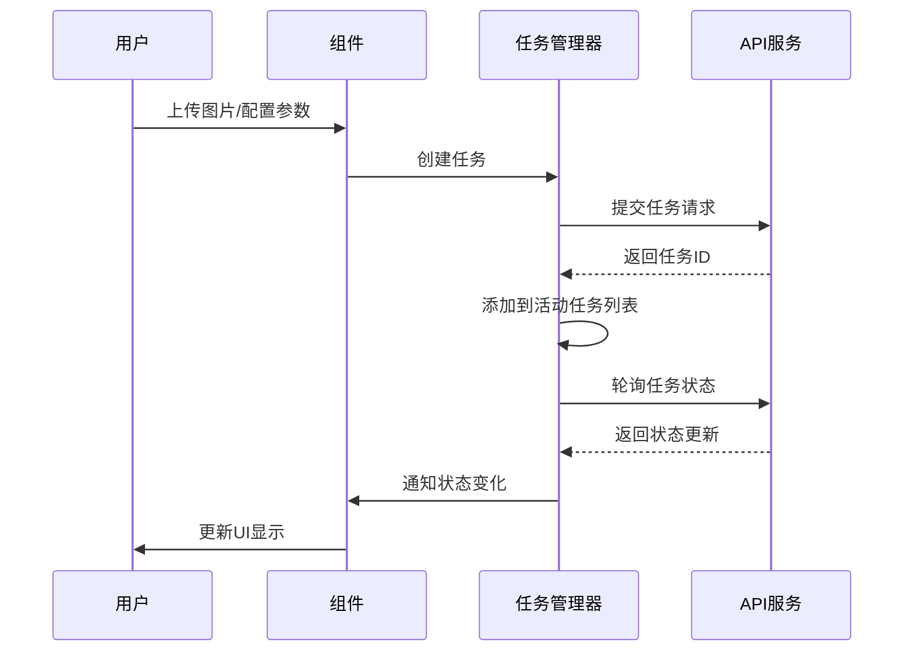
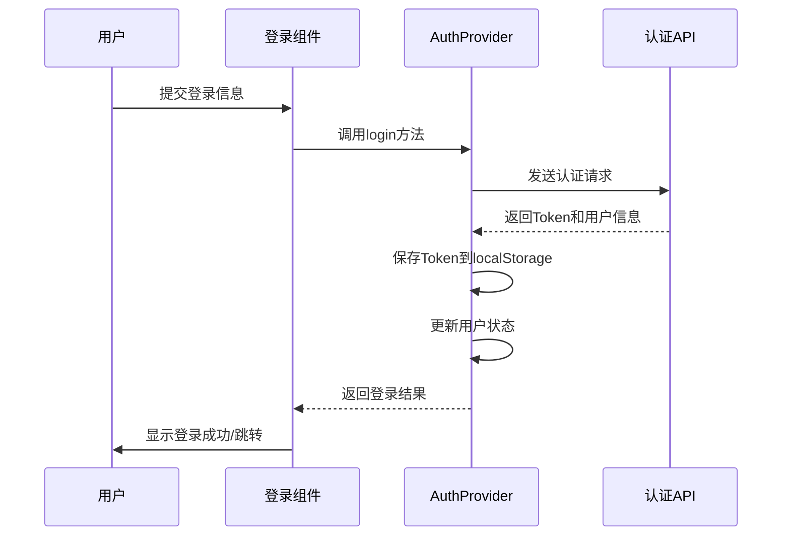

# POD AI Studio 项目架构文档

## 目录

1. [技术架构概览](#技术架构概览)
2. [前端技术栈](#前端技术栈)
3. [项目结构](#项目结构)
4. [核心组件](#核心组件)
5. [状态管理](#状态管理)
6. [数据流](#数据流)
7. [任务管理系统](#任务管理系统)
8. [用户认证系统](#用户认证系统)
9. [性能优化](#性能优化)

## 技术架构概览

POD AI Studio 采用现代化的前端技术栈，基于 React + TypeScript 构建，使用 Vite 作为构建工具。整体架构遵循组件化、模块化的设计原则，确保代码的可维护性和可扩展性。



## 前端技术栈

### 核心框架与库

| 技术 | 版本 | 用途 |
|------|------|------|
| React | 18.3.1 | UI框架，提供组件化开发能力 |
| TypeScript | 5.x | 类型系统，提高代码质量和开发体验 |
| Vite | 6.3.5 | 构建工具，提供快速的开发体验 |

### UI组件与样式

| 技术 | 版本 | 用途 |
|------|------|------|
| Radix UI | - | 无样式、可访问的UI组件基础 |
| Tailwind CSS | - | 实用优先的CSS框架 |
| Lucide React | 0.487.0 | 图标库 |

### 状态管理与数据处理

| 技术 | 版本 | 用途 |
|------|------|------|
| React Context | - | 轻量级状态管理 |
| React Hook Form | 7.55.0 | 表单状态管理 |
| 自定义HTTP工具 | - | API请求封装 |

## 项目结构

```
podi-design-web/
├── public/                    # 静态资源（静态 HTML / icons / 公共文件）
│   └── test-polling.html
├── build/                     # 生产构建输出（由 `npm run build` 生成）
│   ├── index.html
│   └── assets/
├── docs/                      # 项目文档
│   ├── api.md
│   ├── architecture.md
│   ├── development-guide.md
│   └── ...
├── src/                       # 源代码（主要开发目录）
│   ├── App.tsx
│   ├── main.tsx
│   ├── index.css
│   ├── assets/                # 静态图片与资源
│   │   └── images/
│   ├── components/            # 复用组件与 UI 组件
│   │   ├── EnhancedImageUpload.tsx
│   │   ├── GalleryManager.tsx
│   │   ├── ImageCarousel.tsx
│   │   └── ui/                # 基础 UI 组件集合（Button, Card, Dialog 等）
│   ├── pages/                 # 页面级组件（按功能目录组织）
│   │   ├── AIImageEditor/            # AI 编辑器页面
│   │   │   └── AIImageEditorPage.tsx
│   │   ├── AIProcessorTools/         # 各类 AI 工具与处理器（Upscale, Seamless, Pattern 等）
│   │   │   ├── LosslessUpscaleProcessor.tsx
│   │   │   ├── PatternExtractProcessor.tsx
│   │   │   └── SeamlessProcessor.tsx
│   │   ├── AIToolsPage/              # AI 工具入口页面
│   │   │   └── AIToolsPage.tsx
│   │   ├── AIToolsLayout/            # AI 工具布局容器
│   │   │   └── AIToolsLayout.tsx
│   │   ├── BatchTaskDashboard/       # 批量任务仪表盘（重命名/增强后的 Dashboard）
│   │   │   ├── BatchTaskDashboardPage.tsx
│   │   │   ├── BatchTaskCard.tsx
│   │   │   └── BatchTaskFilterBar.tsx
│   │   ├── Header/                   # 头部与全局小组件
│   │   │   └── Header.tsx
│   │   ├── Login/                    # 登录页面
│   │   │   └── LoginPage.tsx
│   │   ├── PersonalCenter/           # 个人中心
│   │   │   └── PersonalCenterPage.tsx
│   │   ├── PersonalGallery/          # 个人图库（网格/列表/预览/批量操作）
│   │   │   ├── PersonalGalleryPage.tsx
│   │   │   ├── GalleryToolbar.tsx
│   │   │   └── ImageCard.tsx
│   │   ├── PointsHistory/            # 积分/余额相关页面
│   │   │   └── PointsHistoryPage.tsx
│   │   ├── Register/                 # 注册页面
│   │   │   └── RegisterPage.tsx
│   │   ├── Sidebar/                  # 侧边栏与导航
│   │   │   └── Sidebar.tsx
│   │   ├── SSO/                      # 单点登录处理
│   │   │   └── SSOHandler.tsx
│   │   └── TaskDetail/               # 任务详情与结果查看
│   │       └── TaskDetailPage.tsx
│   ├── contexts/              # React Context 提供者（Auth, Notifications, Points 等）
│   ├── hooks/                 # 自定义 Hooks（useGalleryData, useTaskPolling 等）
│   ├── services/              # 后端 API 封装（http.ts, image service, points api 等）
│   ├── constants/             # 常量集合（gallery, task, image, sidebar 等）
│   ├── styles/                # 全局与原子样式文件
│   └── types/                 # TypeScript 类型定义
├── package.json
├── tsconfig.json
├── vite.config.ts
└── README.md
```

## 核心组件

### 应用架构组件

#### App.tsx
应用的主入口组件，负责：
- 路由管理和页面切换
- 全局状态初始化
- 主题切换逻辑
- 认证状态管理

#### Sidebar.tsx
侧边导航组件，提供：
- 功能模块导航
- 用户状态显示
- 响应式布局适配

#### Header.tsx
顶部导航组件，包含：
- 用户信息展示
- 主题切换按钮
- 通知中心入口

#### Dashboard.tsx
仪表板组件，实现：
- 任务状态展示
- 数据统计可视化
- 快速操作入口

### AI处理工具组件

每个AI处理工具都是独立的组件，遵循统一的设计模式：

```typescript
interface ToolProcessorProps {
  action: string; // 工具类型标识
}

function ToolProcessor({ action }: ToolProcessorProps) {
  // 1. 状态管理
  const [uploadedImages, setUploadedImages] = useState<ImageData[]>([]);
  const [processingParams, setProcessingParams] = useState<Params>({});
  const [taskStatus, setTaskStatus] = useState<TaskStatus>('idle');
  
  // 2. 图片上传处理
  const handleImageUpload = (images: ImageData[]) => {
    setUploadedImages(images);
  };
  
  // 3. 参数变更处理
  const handleParamChange = (params: Params) => {
    setProcessingParams(params);
  };
  
  // 4. 任务提交处理
  const handleSubmit = async () => {
    // 提交任务到后端
  };
  
  // 5. 结果渲染
  return (
    <div>
      {/* 图片上传区域 */}
      {/* 参数配置区域 */}
      {/* 任务提交按钮 */}
      {/* 结果展示区域 */}
    </div>
  );
}
```

## 状态管理

### 认证状态管理

使用React Context管理用户认证状态：

```typescript
// AuthContext.tsx
interface AuthContextType {
  user: User | null;
  isLoading: boolean;
  login: (credentials: LoginCredentials) => Promise<void>;
  logout: () => void;
  register: (userData: RegisterData) => Promise<void>;
  checkAuth: () => Promise<void>;
}

// AuthProvider.tsx
export const AuthProvider: React.FC<{ children: React.ReactNode }> = ({ children }) => {
  const [user, setUser] = useState<User | null>(null);
  const [isLoading, setIsLoading] = useState(true);
  
  // 认证逻辑实现...
  
  return (
    <AuthContext.Provider value={{ user, isLoading, login, logout, register, checkAuth }}>
      {children}
    </AuthContext.Provider>
  );
};
```

### 任务状态管理

使用自定义Hook管理任务状态：

```typescript
// taskManager.ts
export interface Task {
  id: string;
  status: TaskStatus;
  progress: number;
  createdAt: Date;
  updatedAt: Date;
  // 其他任务属性...
}

// 任务管理Hook
export const useTaskManager = () => {
  const [tasks, setTasks] = useState<Task[]>([]);
  const [activeTasks, setActiveTasks] = useState<Set<string>>(new Set());
  
  // 任务管理逻辑...
  
  return {
    tasks,
    activeTasks,
    addTask,
    removeTask,
    updateTaskStatus,
    // 其他方法...
  };
};
```

## 数据流

### API请求流程



### 任务处理流程



## 任务管理系统

### 任务状态枚举

```typescript
export enum TaskStatus {
  PENDING = 'pending',
  PROCESSING = 'processing',
  COMPLETED = 'completed',
  FAILED = 'failed',
  CANCELED = 'canceled'
}
```

### 任务监控机制

实现了两种任务监控机制：

1. **轮询机制**：定期查询任务状态
2. **事件驱动机制**：基于页面可见性变化触发状态检查

```typescript
// taskMonitoringEventSystem.ts
export class TaskMonitoringEventSystem {
  private taskIds: Set<string> = new Set();
  private callbacks: Map<string, Function[]> = new Map();
  
  // 添加任务到监控列表
  addTask(taskId: string): void {
    this.taskIds.add(taskId);
  }
  
  // 移除任务监控
  removeTask(taskId: string): void {
    this.taskIds.delete(taskId);
  }
  
  // 注册状态变化回调
  onStatusChange(taskId: string, callback: Function): void {
    // 实现回调注册
  }
  
  // 检查所有任务状态
  async checkAllTasksStatus(): Promise<void> {
    // 实现状态检查逻辑
  }
}
```

### 任务动态集合管理

```typescript
// taskDynamicCollectionManager.ts
export class TaskDynamicCollectionManager {
  private collection: Map<string, TaskStatus> = new Map();
  
  // 添加任务
  addTask(taskId: string, status: TaskStatus): void {
    this.collection.set(taskId, status);
  }
  
  // 更新任务状态
  updateTaskStatus(taskId: string, status: TaskStatus): void {
    if (this.collection.has(taskId)) {
      this.collection.set(taskId, status);
    }
  }
  
  // 获取所有活动任务
  getActiveTasks(): string[] {
    return Array.from(this.collection.keys()).filter(
      taskId => this.collection.get(taskId) !== TaskStatus.COMPLETED
    );
  }
}
```

## 用户认证系统

### 认证流程



### Token管理

```typescript
// http.ts
const http = {
  async request<T>(config: AxiosRequestConfig): Promise<T> {
    // 添加认证头
    const token = localStorage.getItem('token');
    if (token) {
      config.headers = {
        ...config.headers,
        Authorization: `Bearer ${token}`
      };
    }
    
    try {
      const response = await axios(config);
      return response.data;
    } catch (error) {
      // 处理Token过期
      if (error.response?.status === 401) {
        // 清除Token并重定向到登录页
        localStorage.removeItem('token');
        window.location.href = '/login';
      }
      throw error;
    }
  }
};
```

## 性能优化

### 代码分割

使用React.lazy和Suspense实现组件级别的代码分割：

```typescript
// 懒加载AI工具组件
const UpscaleProcessorV2 = React.lazy(() => import('./components/UpscaleProcessorV2'));
const PatternExtractorV2 = React.lazy(() => import('./components/PatternExtractorV2'));

// 在路由中使用
<Suspense fallback={<div>加载中...</div>}>
  <Route path="/hires" component={UpscaleProcessorV2} />
  <Route path="/pattern-extract" component={PatternExtractorV2} />
</Suspense>
```

### 图片优化

1. **图片懒加载**：使用Intersection Observer实现图片懒加载
2. **缩略图生成**：上传后立即生成缩略图，提高加载速度
3. **图片压缩**：上传前进行客户端压缩，减少传输数据量

```typescript
// 图片压缩工具
export const compressImage = (file: File, quality = 0.7): Promise<File> => {
  return new Promise((resolve) => {
    const canvas = document.createElement('canvas');
    const ctx = canvas.getContext('2d');
    const img = new Image();
    
    img.onload = () => {
      // 计算压缩后的尺寸
      const { width, height } = calculateCompressedSize(img.width, img.height);
      canvas.width = width;
      canvas.height = height;
      
      // 绘制压缩后的图片
      ctx?.drawImage(img, 0, 0, width, height);
      
      // 转换为Blob
      canvas.toBlob((blob) => {
        if (blob) {
          const compressedFile = new File([blob], file.name, {
            type: file.type,
            lastModified: Date.now()
          });
          resolve(compressedFile);
        }
      }, file.type, quality);
    };
    
    img.src = URL.createObjectURL(file);
  });
};
```

### 任务状态缓存

使用localStorage缓存任务状态，减少不必要的API请求：

```typescript
// 任务缓存工具
export const taskCache = {
  getTask(taskId: string): Task | null {
    const cached = localStorage.getItem(`task_${taskId}`);
    return cached ? JSON.parse(cached) : null;
  },
  
  setTask(taskId: string, task: Task): void {
    localStorage.setItem(`task_${taskId}`, JSON.stringify(task));
  },
  
  removeTask(taskId: string): void {
    localStorage.removeItem(`task_${taskId}`);
  },
  
  clearExpiredTasks(): void {
    // 清理过期的任务缓存
  }
};
```

---

本架构文档将随着项目的发展持续更新，确保反映最新的技术决策和实现细节。