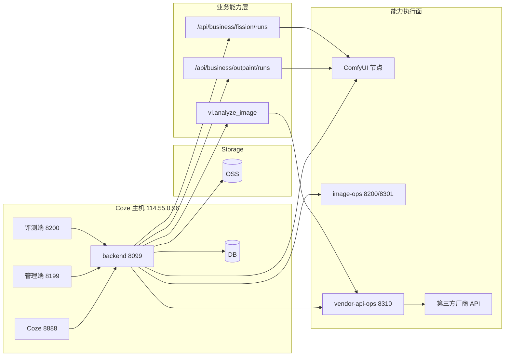

# PODI 平台架构与边界（总览）

> 版本：2026-06-10
> 目的：先明确整体边界与核心契约，再细化各平台子功能。强调“抽象与解耦”，避免因业务变化频繁返工。

## 1. 系统总览

PODI 当前由控制面、业务能力层、业务接入/实验层、能力执行面、验证面组成：

- **Coze 服务器控制面（114.55.0.56）**：Coze + backend + 管理端 + 测评端。
- **后端 backend（FastAPI）**：业务能力 API、能力目录、工具箱 OpenAPI、任务调度、路由、回调、OSS、日志。
- **管理端（podi-admin-web）**：执行节点、能力、工作流、Key、测试与监控。
- **评测站点（podi-eval-web）**：Coze 工作流评测、回归验证、文档与结果可视化。
- **能力执行面**：ComfyUI、image-ops、vendor-api-ops 等外部执行服务。

### 1.1 分层定位与边界
- **控制面（backend）**：只做能力接入、路由、调度、状态、文档、OSS 和日志，不承载重执行。
- **业务能力层（backend）**：沉淀图裂变、扩图等稳定业务入口，负责版本、配方、灰度、回滚和运行记录。
- **业务接入/实验层（Coze）**：只通过 backend 工具箱调用能力，不直连 ComfyUI、image-ops、vendor-api-ops；复杂编排逐步收归 backend 业务 API。
- **能力执行层（ComfyUI / image-ops / vendor-api-ops）**：只负责执行能力，不承担平台目录和工具箱契约。
- **评测层（podi-eval-web）**：把业务 workflow 做成交互式评测页面，支持打分/备注，并输出文档供业务快速接入。

> 边界强调：backend 是控制面，不是 GPU、高清放大或第三方特殊网络能力的执行面。

核心目标：
**能力定义与执行解耦**，**能力执行与展示解耦**，**评测链路与生产链路解耦**。


```mermaid
flowchart LR
    subgraph CozeHost["Coze 主机 114.55.0.56"]
        H[Coze 8888]
        C[backend 8099]
        B[管理端 8199]
        A[评测端 8200]
        D[(DB)]
    end
    subgraph Storage
        E[(OSS)]
    end
    subgraph BusinessLayer["业务能力层"]
        F["/api/business/fission/runs"]
        G["/api/business/outpaint/runs"]
        I["vl.analyze_image"]
    end
    subgraph AbilityPlane["能力执行面"]
        J[ComfyUI 节点]
        K[image-ops 8200/8301]
        L[vendor-api-ops 8310]
        M[第三方厂商 API]
    end

    A --> C
    B --> C
    H --> C
    C --> F
    C --> G
    C --> I
    C --> D
    C --> E
    F --> J
    G --> J
    I --> L
    C --> J
    C --> K
    C --> L --> M
```

### 1.2 当前线上部署口径（2026-04-24）

| 服务 | 当前职责 | 端口 / 地址 | 说明 |
| --- | --- | --- | --- |
| Coze | 业务编排 | `114.55.0.56:8888` | 工作流编排入口 |
| backend | 控制面与工具箱 | `114.55.0.56:8099` | Coze 工具箱统一指向这里 |
| 管理端 | 中台管理 | `114.55.0.56:8199` | build 后静态运行 |
| 测评端 | 内部评测 | `114.55.0.56:8200` | build 后静态运行；`8299` 只能作为本地临时静态代理端口，不是线上口径 |
| image-ops | 自研图像原子能力 | `117.50.80.158:8200`（158 / 5090） | 高清放大、DPI 等执行面；后续可改为独立端口 |
| vendor-api-ops | 第三方 API 原子能力 | `117.50.80.158:8310`（158 / 5090） | OpenAI、KIE、火山、百度等 API 执行面 |
| ComfyUI | 工作流执行 | `117.50.80.158:8079`（158 / 5090）+ `117.50.216.233:8079`（233 / 4090） | 只跑能力，不承载中台控制逻辑 |

## 2. 平台边界与职责

### 2.1 后端（业务中台）
- **业务能力 API**：`/api/business/fission/runs`、`/api/business/outpaint/runs`、`/api/business/runs/{runId}`
- **业务版本与配方**：`business_key/version/status/release_time/recipe`，默认版本可切换，旧版本保留回滚。
- **业务调用统计**：`/api/admin/business/usage-summary` 汇总调用量、成功率、失败样本、耗时、成本和额度，为灰度、回滚和收费做数据基础。
- **能力目录**：`/api/abilities`、`/api/abilities/{id}/invoke`
- **任务调度**：`/api/ability-tasks`、异步回调、轮询查询
- **媒资落盘**：任何外链/上游输出统一落 OSS
- **日志与成本**：`ability_invocation_logs`、可追溯/可审计
- **Coze 工具箱**：统一生成 OpenAPI 与执行入口
- **执行路由**：根据能力归属分发到 ComfyUI、image-ops 或 vendor-api-ops

### 2.2 管理端（配置与管理）
- **执行节点**：多机器 ComfyUI / 商业模型的注册与状态查看
- **能力管理**：输入 schema、默认参数、metadata（api_type/模型等）
- **能力测试**：统一入口，输出日志/结果/预览
- **业务观测**：查看业务版本、默认版本、最近调用、统计概览、失败样本与成本/额度预留字段。
- **工作流/绑定**：ComfyUI 工作流与能力绑定管理
- **服务器管理**：ComfyUI 服务器对齐与 Agent 任务下发（详见 `docs/comfyui/agent-management.md`）

### 2.3 评测站点（评测与回归）
- **工作流评测**：调用 Coze workflow；收集结果/回调
- **文档生成**：从 DB 自动生成入参/出参/备注
- **回归验证**：新版本上线前的评测入口

### 2.4 Coze（外部集成）
- **工具箱调用**：`/api/coze/podi/tools/*`
- **任务回调/查询**：`/api/coze/podi/tasks/get`
- **队列状态**：`/api/coze/podi/comfyui/queue-summary`
- **硬约束**：Coze 只调用 backend，不直连任何执行节点。

### 2.5 能力执行面
- **ComfyUI executor**：图裂变、扩图、抠图、多图融合、四方连续等 workflow。
- **image-ops**：DPI、高清放大、尺寸/格式等自研图像处理能力。
- **vendor-api-ops**：OpenAI、火山、百度、KIE、中转站等第三方 API 能力。
- **硬约束**：执行面只执行能力，不维护 Coze contract，不承载平台业务状态。

## 3. 核心抽象与解耦（必须遵守）

### 3.1 Ability（能力定义）
- 定义在 `backend/app/constants/abilities.py`
- 必须包含：`defaults`、`input_schema`、`metadata.api_type`
- **能力定义与执行节点解耦**：能力不直接绑定机器
- VL 图像理解作为原子能力进入弹药库，第一阶段能力 ID 为 `vl_analyze_image`。

### 3.1.1 BusinessCapability（业务能力版本）
- 定义业务方能理解的稳定入口，例如 `fission` / `outpaint`。
- 每个版本必须包含 `business_key`、`version`、`status`、`release_time`、`recipe`。
- `recipe.primaryAbilityId` 指向底层原子能力；后续可扩展为多步骤配方，例如 VL 分析 -> 图裂变 -> 结果入库。
- 业务方默认只关心 `runId/status/imageUrls/error`，不需要理解底层 workflow 或 executor。

### 3.2 Executor（执行节点）
- 定义在 `config/executors.yaml`
- 负责：`baseUrl`、`apiKey`、并发、权重
- **执行节点可替换**，能力不应硬编码服务器地址
- 重执行能力必须显式路由，不允许静默 fallback 到 Coze 主机本机执行。
- 第三方 API 能力优先使用 `vendor_api` executor，不再由 backend 直接保存厂商调用细节。
- 第三方模型、密钥、能力与调用统计通过 `GET /api/admin/vendor-api/governance/summary` 汇总，作为后续管理端简化展示的数据入口。

### 3.3 Workflow / Binding（工作流与绑定）
- Workflow JSON 存在于 `backend/app/workflows/comfyui/`
- Binding 将 workflow 与 ability 关联
- **workflow 只描述流程，能力只描述输入/输出**

### 3.4 Task / Log（任务与日志）
- 任务用于异步处理，日志用于追溯
- 统一写入 `ability_invocation_logs`，确保排查入口一致
- 统一双阶段状态字段（增量兼容）：
  - `submit_status`（提交阶段）
  - `callback_status`（回填阶段）
  - `final_status`（最终可展示状态）
  - `error_code`（标准错误码）

### 3.5 Media Ingest（媒资落盘）
- 任何 `url/base64` 都先入 OSS
- 对外只暴露 OSS URL，避免外链失效
- 生成结果类位图在入 OSS 前默认写入 `OUTPUT_IMAGE_DEFAULT_DPI=150` 的 DPI/PPI 元数据，结果后处理图也复用该口径；用户源图、蒙版、标注图等输入或中间资产保持原始字节。该动作不改变像素尺寸，只修正交付文件元数据。设为 `0` 可关闭。
- OSS 内网地址替换是独立灰度项：内部链路可逐步切内网，对外返回默认继续公网稳定地址。

## 4. 核心契约（接口/参数/回调）

### 4.1 输入参数（统一约定）
- **图片输入统一用 `url`**（Coze/评测/业务一致）
- 数值输入 **禁止带 `px`**
- 需要枚举的参数必须明确 options（避免误填）

### 4.2 输出参数（统一约定）
- 直接输出类：`output = 图片 URL`
- 回调类：`output = taskId`
  再通过 `/api/coze/podi/tasks/get` 查询结果

### 4.3 回调与轮询
- 所有异步能力都必须可查询/可回调
- `taskId` 返回格式可解析（`t1.<provider>.<executorId>.<raw>`）
- ComfyUI（自有队列）与第三方平台（外部异步）必须分层处理：
  - ComfyUI 以队列与事件为主，不用固定硬超时直接判死
  - 第三方可采用软超时 + 补偿回填策略

### 4.4 ComfyUI 多机同步（新增）
- 清单版本生命周期：`draft -> published -> rolled_back`
- 主服务器不写死 IP，改为“角色 + 主节点指针”
- 发布默认灰度，失败可回滚，并提供清单漂移对比（期望 vs 节点快照）
- 执行面以“桌面端代理服务（Windows 先行）”统一承接：
  - 首次接入：注册码交换 `agent_id/agent_token/jwt_keys`
  - 任务处理：本地验签 + `/api/agent/auth/verify` 双重校验
  - 运维目标：安装即配置、体检通过即可接入中台

## 5. 数据流（简化）

```
调用端/Coze → backend 工具箱/能力接口 → executor 路由 → 执行面
          ↓
       结果落 OSS → 返回 output / taskId → 回调/轮询
```

### 5.1 Coze 工具箱固定流向

```text
Coze Workflow
  -> backend /api/business/* 或 /api/coze/podi/*
    -> ComfyUI executor
    -> image-ops
    -> vendor-api-ops
      -> 第三方厂商 API
```

新 Coze workflow 优先调用 `/api/business/*` 扁平业务入口；旧 `/api/coze/podi/*` 工具箱继续保留，作为兼容和快速实验入口。

## 6. 运行约定（铁律）

- Coze：8888
- 后端：8099
- 管理端：8199
- 评测站点：8200
- vendor-api-ops：8310
- image-ops：当前 158 / 5090 服务器沿用 8200，后续如独立迁移建议 8301

详见 `docs/development-guide.md`

## 7. 关联文档（按层级）

### 总览
- `docs/architecture.md`（本文件）
- `docs/README.md`

### 平台子功能
- 管理端：`docs/ai-integration-management.md`
- 评测站点：`docs/eval/eval-platform.md`
- Coze 工具箱：`docs/coze/toolbox-inventory.md`
- Coze/ComfyUI 对应表：`docs/coze/comfyui-workflow-mapping.md`
- 业务能力 API：`docs/api/modules/business.md`
- 原子能力边界：`docs/standards/atomic-ability-boundary.md`
- 第三方 API 执行面：`docs/plans/2026-04-24-vendor-api-ops-mvp.md`

### 运行与排查
- `docs/TROUBLESHOOTING.md`
- `docs/standards/queue-and-error-standards.md`
- `docs/standards/abstraction-and-decoupling.md`
- `docs/standards/runtime-facts-and-regression-guardrails.md`

---

> 本文件只描述“整体边界与契约”，不展开各平台子功能细节。
> 子功能详解请在对应平台文档中更新。
