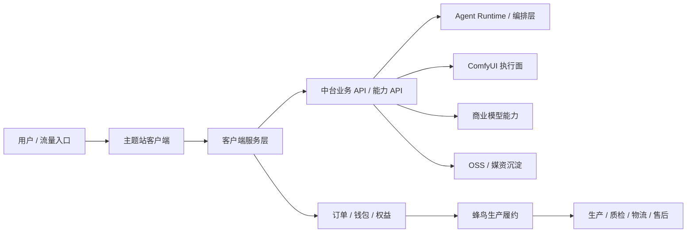

# 当前经营与技术主线（2026-07-08）

本文作为当前阶段的事实入口。若历史文档与本文冲突，以本文为准，再回到 `docs/standards/runtime-facts-and-regression-guardrails.md` 核对运行事实。

## 当前结论

- 项目主线已经从“给合作方持续建设中台”切换为“自有、可运营、可收费、可复制的客户端产品”。
- 中台不再是主要产品形态，但仍是所有客户端和主题站的能力接入口，负责能力治理、调度、凭证、成本、日志、错误契约、媒资沉淀和审计。
- 当前客户端雏形在 `podi-client-web/`，方向是 `AI创品 / AI 图片处理 + POD 定制商品`。它已具备首页、图片批处理、商品货盘、素材库、灵感广场、订单、钱包、公开审核等入口；2026-07-12 起，登录后的生产订单读取和受控杯型订单创建已接入中台真源。其余商品预览、报价、支付、产品券核销和多数履约状态仍在分阶段替换，不能按“全量已上线”理解。
- 未来要把客户端抽成可复制主题站：杯子站只是第一个主题，后续可复制到 T 恤、帆布包、抱枕、毛毯、手机壳、节日礼品等垂直站。
- ComfyUI 仍临时使用 `158/5090/117.50.80.158` 与 `233/4090/117.50.216.233` 两个执行面。它们属于过渡资源，不是长期资产。
- 其他商业模型能力由我们自己接入和治理，不再依赖旧合作方链路。
- 生产履约已接入蜂鸟（Humcustom）下单和查询：中台生成指定像素/DPI 的生产文件、保存 OSS 证据，平台支付成功后自动推送蜂鸟并保存蜂鸟订单号；运营随后比对 AI创品与蜂鸟两边数据，在蜂鸟后台确认生产、选择物流并支付供应链。本站运营端负责对账、同步和失败重试，不设置推送前人工放行。2026-07-12 已完成一个 CN 受控订单的真实接收验证。效果图/物流字段仍取决于蜂鸟查询或回调返回，尚不能伪造回传；完整范围见 `docs/releases/2026-07-12-ai-chuangpin-v0.1-design-to-production-baseline.md`。
- 2026-07-09 决策：可以买一台阿里云 ECS，但定位为“线上内测 / 预发布环境”，不是最终生产架构；不采购 GPU，ComfyUI 仍临时复用 `158/5090/117.50.80.158` 与 `233/4090/117.50.216.233`。部署清单见 `docs/strategy/prelaunch-deployment-plan-2026-07-09.md`。

## 产品结构

## 主题站复制模型

共享能力：

- 用户、登录、素材库、任务中心、钱包、产品券、站内抵扣、公开审核、灵感广场、订单、售后。
- 中台业务 API、原子能力 API、能力日志、媒资沉淀、错误契约、成本统计。
- Agent Runtime、工具白名单、工具 schema、确认门、审计链路。

每个主题站可配置：

- 品牌名、域名、首页文案、SEO 页面、导航。
- 商品类目、产品模板、设计面尺寸、可印刷区域、安全区、工艺和价格。
- 默认能力组合，例如杯子站偏花纹提取/两方连续/四方连续，服饰站偏背景处理/套版/模特图。
- 示例素材、灵感内容、活动券、运营位、分享奖励规则。
- 蜂鸟或其他供应链商品映射。

## 当前开发优先级

1. 把 `podi-client-web/` 从演示壳推进到真实业务闭环：上传到 OSS、提交中台业务 run、轮询结果、沉淀素材、生成产品样例、创建生产订单。
2. 接入成熟 Agent Runtime，但后端继续保留工具执行控制权。
3. 建立蜂鸟生产接入资料、状态映射、错误契约和证据链。
4. 清理普通用户路径里的工程词：模型、路由、runId、taskId、执行节点、OSS、Base64、Coze、ComfyUI 节点。
5. 管理端保留中台治理能力，但把 Coze 和 114 口径降为历史兼容，不再作为当前主路径。
6. 补互联网产品基础：真实路由、账号体系、支付或手工收款过渡、订单生产状态、内容审核、埋点、SEO、客服与售后。
7. 建立预发布环境：ECS + RDS MySQL + OSS `prelaunch/` 前缀 + HTTPS + 运营后台，用固定公网环境验证用户主链路和后台闭环。

## 非目标

- 不继续围绕旧合作方做专属交付。
- 不把 Coze 作为当前主链路。
- 不把普通客户端做成中台控制台。
- 不承诺一次性全品类实物履约。
- 不让 Agent 直接绕过后端调用模型、ComfyUI 或生产系统。

最后更新：2026-07-14
