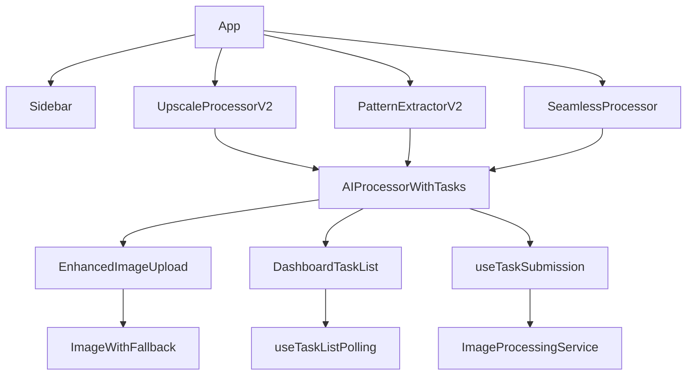

# AI作图工具菜单功能交互梳理

## 1. 项目概述

### 1.1 技术栈
- **前端框架**: React 18 + TypeScript
- **构建工具**: Vite
- **UI组件库**: shadcn/ui
- **状态管理**: React Hooks + Context API
- **路由**: React Router
- **图标库**: Lucide React
- **通知系统**: Sonner

### 1.2 项目结构
```
src/
├── components/          # 核心组件
│   ├── ui/             # shadcn/ui组件
│   ├── figma/          # Figma相关组件
│   ├── AIProcessor.tsx # AI处理组件（旧版本）
│   ├── AIToolsPage.tsx # AI工具主页面（旧版本）
│   ├── AIToolsPageV2.tsx # 新的AI工具选择页面
│   ├── CompactAIProcessor.tsx # 通用AI处理组件（旧版本）
│   ├── PatternExtractor.tsx # 印花提取组件（旧版本）
│   ├── PatternExtractorV2.tsx # 印花提取组件（新版本）
│   ├── Sidebar.tsx     # 侧边栏菜单
│   ├── UpscaleProcessorV2.tsx # 无损放大组件
│   ├── SeamlessProcessor.tsx # 四方连续组件
│   ├── TwoWaySeamlessProcessor.tsx # 两方连续组件
│   ├── ImageExtensionProcessor.tsx # 图片扩展组件
│   ├── ImageMergeProcessor.tsx # 图片融合组件
│   ├── Img2ImgProcessor.tsx # 图生图组件
│   ├── FissionProcessor.tsx # 图裂变组件
│   ├── AIProcessorWithTasks.tsx # 带有任务管理的AI处理器（核心组件）
│   ├── DashboardTaskList.tsx # 任务列表组件（核心组件）
│   ├── EnhancedImageUpload.tsx # 增强图片上传组件（核心组件）
│   └── ...             # 其他组件
├── hooks/              # 自定义Hooks
│   ├── useTaskListPolling.ts # 任务列表轮询Hook（核心Hook）
│   └── useTaskSubmission.ts # 任务提交Hook
├── services/           # 服务层
│   └── ImageProcessingService.ts # 图像处理服务
├── utils/              # 工具函数
│   ├── unifiedSmartPollingManager.ts # 统一智能轮询管理器（未使用）
│   └── workflow.ts     # 工作流相关工具
└── contexts/           # Context API
    └── AuthContext.tsx # 认证上下文
```

## 2. AI工具菜单结构

### 2.1 菜单定义
- **文件位置**: `src/components/Sidebar.tsx`
- **菜单类型**: 侧边栏固定菜单
- **路由模式**: 基于React Router的直接路径匹配
- **核心特点**: 菜单项直接链接到对应工具组件的路由，不通过中间页面

### 2.2 菜单项列表

| 菜单ID | 菜单名称 | 图标 | 路由路径 | 实际组件实现 | 路由直接使用 |
|--------|----------|------|----------|--------------|--------------|
| hires | 无损放大 | Sparkles | /aitl/hires | UpscaleProcessorV2 | ✅ 直接使用 |
| pattern-extract | 印花提取 | Grid3X3 | /aitl/pattern-extract | PatternExtractorV2 | ✅ 直接使用 |
| fission | 图裂变 | GitBranch | /aitl/fission | FissionProcessor | ✅ 直接使用 |
| img2img | 图生图 | Palette | /aitl/img2img | Img2ImgProcessor | ✅ 直接使用 |
| seamless | 四方连续 | Grid3X3 | /aitl/seamless | SeamlessProcessor | ✅ 直接使用 |
| twoway | 两方连续 | Grid3X3 | /aitl/twoway | TwoWaySeamlessProcessor | ✅ 直接使用 |
| extend | 扩展图 | Upload | /aitl/extend | ImageExtensionProcessor | ✅ 直接使用 |
| merge | 图片融合 | Merge | /aitl/merge | ImageMergeProcessor | ✅ 直接使用 |

### 2.3 路由配置与组件关系

**核心发现**: 项目当前采用直接路由映射模式，每个菜单项直接链接到对应工具组件的路由，不通过中间页面

```typescript
// 路由配置示例（App.tsx）
<Route path="/aitl/hires" element={<UpscaleProcessorV2 action="hires" />} />
<Route path="/aitl/pattern-extract" element={<PatternExtractorV2 action="pattern-extract" />} />
<Route path="/aitl/seamless" element={<SeamlessProcessor action="seamless" />} />
// ... 其他路由
```

## 3. 核心组件功能分析

### 3.1 Sidebar 组件
- **功能**: 提供AI工具菜单导航
- **实现**: 使用React Router的Link组件实现直接路由跳转
- **交互**: 点击菜单项，高亮当前选中项，直接跳转到对应工具组件
- **样式**: 固定在左侧，宽度64px，使用卡片式设计

### 3.2 直接使用的工具组件

| 组件名称 | 功能描述 | 文件位置 | 使用情况 |
|----------|----------|----------|----------|
| UpscaleProcessorV2 | 无损放大 | src/components/UpscaleProcessorV2.tsx | ✅ 直接使用 |
| PatternExtractorV2 | 印花提取 | src/components/PatternExtractorV2.tsx | ✅ 直接使用 |
| SeamlessProcessor | 四方连续 | src/components/SeamlessProcessor.tsx | ✅ 直接使用 |
| TwoWaySeamlessProcessor | 两方连续 | src/components/TwoWaySeamlessProcessor.tsx | ✅ 直接使用 |
| ImageExtensionProcessor | 图片扩展 | src/components/ImageExtensionProcessor.tsx | ✅ 直接使用 |
| ImageMergeProcessor | 图片融合 | src/components/ImageMergeProcessor.tsx | ✅ 直接使用 |
| Img2ImgProcessor | 图生图 | src/components/Img2ImgProcessor.tsx | ✅ 直接使用 |
| FissionProcessor | 图裂变 | src/components/FissionProcessor.tsx | ✅ 直接使用 |

### 3.3 核心大型组件分析

#### 3.3.1 DashboardTaskList.tsx (1621行)
- **核心功能**: 任务列表展示组件，显示用户的AI处理任务
- **使用情况**: 被多个组件引用，包括PatternExtractor、ImageMergeProcessor、StyleTransferProcessor、Txt2ImgProcessor、WorkflowManager、LocalReplaceProcessor等
- **重要性**: ⭐⭐⭐⭐⭐ 核心组件，被多个页面使用
- **特点**: 支持任务列表展示、任务状态更新、任务重试、结果下载等功能
- **轮询实现**: 使用useTaskListPolling自定义Hook，不依赖unifiedSmartPollingManager

#### 3.3.2 AIProcessorWithTasks.tsx (1492行)
- **核心功能**: 带有任务管理的AI处理器，是许多AI工具的核心组件
- **使用情况**: 被多个组件引用，包括ImageMergeProcessorNew、Img2ImgProcessorNew、PatternExtractorV2、UpscaleProcessor、TwoWaySeamlessProcessor、FissionProcessor、SeamlessProcessor、ImageExtensionProcessorNew、UpscaleProcessorV2、CutoutProcessor、SmartEraseProcessor、TemplateProcessor、PatternCropProcessor等
- **重要性**: ⭐⭐⭐⭐⭐ 非常核心的组件，被大部分AI工具组件使用
- **特点**: 集成了AI处理和任务管理功能，支持多种AI工具类型

#### 3.3.3 EnhancedImageUpload.tsx (1099行)
- **核心功能**: 增强的图片上传组件，支持多种图片来源
- **使用情况**: 被多个组件引用，包括PatternExtractor、AIProcessorWithTasks、ImageExtensionProcessor、CompactAIProcessor、EnhancedImageUploadDemo、DualImageUpload等
- **重要性**: ⭐⭐⭐⭐⭐ 核心组件，被大部分AI工具使用
- **特点**: 支持单图/多图上传、拖拽上传、图片预览、多种图片来源（本地上传、个人图库、第三方平台）

#### 3.3.4 AIProcessor.tsx (1110行)
- **核心功能**: AI处理组件，旧版本的AI处理逻辑
- **使用情况**: 未直接在路由中使用，但可能被其他组件引用
- **重要性**: ⭐ 旧版本组件，可能被新组件替代
- **特点**: 早期的AI处理逻辑，可能包含过时的功能

#### 3.3.5 CompactAIProcessor.tsx (988行)
- **核心功能**: 紧凑的AI处理组件
- **使用情况**: 被AIToolsPage引用
- **重要性**: ⭐⭐ 被AIToolsPage使用，可能是旧版本组件
- **特点**: 紧凑的AI处理界面，适合简单的AI处理任务

#### 3.3.6 unifiedSmartPollingManager.ts (1314行)
- **核心功能**: 统一的智能轮询管理器，用于管理任务的轮询状态和更新
- **使用情况**: ❌ 未被使用，只有文件内部引用
- **重要性**: ⭐ 未使用的组件，可能是遗留代码
- **特点**: 支持智能轮询策略，根据任务状态调整轮询频率
- **替代方案**: useTaskListPolling Hook实现了相同的功能

### 3.4 核心Hook分析

#### 3.4.1 useTaskListPolling.ts
- **核心功能**: 任务列表轮询Hook，用于管理任务的轮询状态和更新
- **使用情况**: 被DashboardTaskList组件使用
- **重要性**: ⭐⭐⭐⭐ 核心Hook，用于任务状态管理
- **特点**: 支持智能轮询策略，根据任务状态调整轮询频率，支持页面可见性控制

### 3.5 未直接使用的中间组件

| 组件名称 | 功能描述 | 文件位置 | 使用情况 |
|----------|----------|----------|----------|
| AIToolsPage | AI工具主页面 | src/components/AIToolsPage.tsx | ❌ 未直接使用 |
| AIToolsPageV2 | 新的AI工具选择页面 | src/components/AIToolsPageV2.tsx | ❌ 未直接使用 |
| PatternExtractor | 印花提取组件 | src/components/PatternExtractor.tsx | ❌ 未直接使用 |
| unifiedSmartPollingManager | 统一智能轮询管理器 | src/utils/unifiedSmartPollingManager.ts | ❌ 未使用 |

## 4. 交互流程分析

### 4.1 工具选择流程
1. 用户从侧边栏选择AI工具
2. React Router更新路由路径
3. 直接渲染对应工具组件
4. 初始化工具设置表单

### 4.2 任务提交流程
1. 用户上传图片（使用EnhancedImageUpload组件）
2. 用户填写工具设置参数
3. 点击"开始处理"按钮
4. 调用useTaskSubmission Hook提交任务
5. 显示处理中状态和进度
6. 任务提交成功后显示提示
7. 自动刷新任务列表（使用DashboardTaskList组件）

### 4.3 结果展示流程
1. 任务处理完成后（通过useTaskListPolling Hook轮询获取状态）
2. 在右侧预览区域显示处理结果
3. 提供下载按钮
4. 显示处理状态和详细信息

### 4.4 轮询流程
1. DashboardTaskList组件使用useTaskListPolling Hook
2. Hook根据任务状态自动调整轮询频率
3. 当页面不可见时暂停轮询，可见时恢复
4. 支持错误重试机制

## 5. 后端接口交互

### 5.1 接口调用模式
- **基础URL**: 由http工具统一管理
- **请求方法**: POST
- **数据格式**: JSON
- **认证方式**: 通过userId参数识别用户

- **submitTask**: 提交图像处理任务
- **processHiresUpscale**: 专门处理无损放大任务
- **pollUntilImage**: 轮询获取处理结果

### 5.3 任务参数结构
```json
{
  "action": "tool-type",
  "userId": "user-id",
  "taskId": "task-id",
  "imageList": [
    {
      "filename": "image.png",
      "base64": "base64-data" // 或 ossUrl: "oss-url"
    }
  ],
  // 工具特定参数
  "scale": "4x",
  "quality": "fast",
  "model": "baidu",
  // 其他参数...
}
```

## 6. UI样式布局

### 6.1 整体布局
- **三栏布局**: 左侧输入区域、中间设置区域、右侧预览区域
- **响应式设计**: 移动端单栏布局，桌面端三栏布局
- **卡片式设计**: 使用Card组件组织内容，清晰分隔不同功能区域

### 6.2 组件样式
- **按钮**: 使用shadcn/ui的Button组件，支持多种变体
- **表单**: 使用shadcn/ui的Input、Select、Slider等组件
- **标签页**: 使用Tabs组件切换不同设置面板
- **图标**: 使用Lucide React图标库，保持视觉一致性
- **色彩方案**: 采用蓝紫色系主色调，搭配中性色背景

### 6.3 交互反馈
- **加载状态**: 按钮状态变化、进度条显示
- **成功提示**: Sonner通知、成功对话框
- **错误提示**: Sonner错误通知
- **悬停效果**: 按钮、卡片的悬停状态变化

## 7. 组件依赖关系



## 8. 代码现状分析

### 8.1 组件使用现状

#### 8.1.1 核心组件使用情况
| 组件类型 | 组件数量 | 直接使用 | 间接使用 | 未使用 |
|----------|----------|----------|----------|--------|
| 工具组件 | 15+ | 8 | 0 | 7+ |
| 中间页面 | 2 | 0 | 0 | 2 |
| 核心大型组件 | 5+ | 3 | 0 | 2 |
| 通用组件 | 5+ | 2 | 3+ | 0 |
| 工具函数 | 5+ | 4 | 1+ | 1 |

#### 8.1.2 未直接使用的组件
- CutoutProcessor
- StyleTransferProcessor
- LocalReplaceProcessor
- Txt2ImgProcessor
- PatternCropProcessor
- TemplateProcessor
- AIToolsPage
- AIToolsPageV2
- PatternExtractor
- unifiedSmartPollingManager

### 8.2 组件冗余问题

#### 8.2.1 组件版本冗余
| 组件功能 | 旧版本组件 | 新版本组件 | 实际使用情况 |
|----------|------------|------------|--------------|
| AI工具页 | AIToolsPage | AIToolsPageV2 | 均未直接使用 |
| 通用处理 | AIProcessor, CompactAIProcessor | AIProcessorWithTasks | 新版本广泛使用 |
| 印花提取 | PatternExtractor | PatternExtractorV2 | 新版本直接使用 |
| 图片扩展 | ExtensionVisualizer | ImageExtensionProcessor | 新版本直接使用 |
| 轮询管理 | unifiedSmartPollingManager | useTaskListPolling | 新版本（Hook）广泛使用 |

#### 8.2.2 图片上传组件统一问题
- **当前状态**: EnhancedImageUpload是主要使用的图片上传组件，其他上传组件功能相似但使用较少
- **影响**: 功能重复，维护成本高
- **优化建议**: 以EnhancedImageUpload为基础，整合其他图片上传组件的功能

### 8.3 组件大小问题

#### 8.3.1 大型组件分析
- **当前状态**: 存在多个超过1000行的大型组件
- **影响**: 可读性差，维护困难
- **优化建议**: 拆分大型组件，提取通用逻辑到Hooks或utils

## 9. 核心业务功能确认

### 9.1 无损放大功能
- **组件**: UpscaleProcessorV2 → AIProcessorWithTasks → EnhancedImageUpload → DashboardTaskList → useTaskListPolling
- **路由**: /aitl/hires
- **核心功能**: 图片无损放大处理
- **关键参数**: 放大倍数、质量、模型选择

### 9.2 印花提取功能
- **组件**: PatternExtractorV2 → AIProcessorWithTasks → EnhancedImageUpload → DashboardTaskList → useTaskListPolling
- **路由**: /aitl/pattern-extract
- **核心功能**: 从图片中提取印花图案
- **关键参数**: 参考图片、提取描述、品类选择

### 9.3 四方连续功能
- **组件**: SeamlessProcessor → AIProcessorWithTasks → EnhancedImageUpload → DashboardTaskList → useTaskListPolling
- **路由**: /aitl/seamless
- **核心功能**: 创建可无缝拼接的四方连续图案
- **关键参数**: 拼接模式、图案尺寸

### 9.4 两方连续功能
- **组件**: TwoWaySeamlessProcessor → AIProcessorWithTasks → EnhancedImageUpload → DashboardTaskList → useTaskListPolling
- **路由**: /aitl/twoway
- **核心功能**: 创建可无缝拼接的两方连续图案
- **关键参数**: 拼接方向、图案尺寸

### 9.5 图片扩展功能
- **组件**: ImageExtensionProcessor → EnhancedImageUpload → DashboardTaskList → useTaskListPolling
- **路由**: /aitl/extend
- **核心功能**: 扩展图片边界
- **关键参数**: 扩展方向、扩展尺寸、扩展描述

### 9.6 图片融合功能
- **组件**: ImageMergeProcessor → DashboardTaskList → useTaskListPolling
- **路由**: /aitl/merge
- **核心功能**: 多张图片智能融合
- **关键参数**: 融合描述、图片顺序

### 9.7 图生图功能
- **组件**: Img2ImgProcessor → DashboardTaskList → useTaskListPolling
- **路由**: /aitl/img2img
- **核心功能**: 基于现有图片生成新图片
- **关键参数**: 生成描述、风格选择、模型选择

### 9.8 图裂变功能
- **组件**: FissionProcessor → AIProcessorWithTasks → EnhancedImageUpload → DashboardTaskList → useTaskListPolling
- **路由**: /aitl/fission
- **核心功能**: 将一张图片裂变生成多张相似图片
- **关键参数**: 裂变数量、风格选择、模型选择

## 10. 代码优化建议

### 10.1 组件清理建议
- **删除未使用组件**: CutoutProcessor、StyleTransferProcessor、LocalReplaceProcessor、Txt2ImgProcessor、PatternCropProcessor、TemplateProcessor、unifiedSmartPollingManager
- **保留核心组件**: DashboardTaskList、AIProcessorWithTasks、EnhancedImageUpload
- **标记废弃组件**: AIToolsPage、AIToolsPageV2、PatternExtractor

### 10.2 目录结构优化建议
```
src/
├── components/          # 核心组件
│   ├── ui/             # shadcn/ui组件
│   ├── figma/          # Figma相关组件
│   ├── ai-tools/       # AI工具组件（按功能分类）
│   │   ├── common/     # 通用AI组件
│   │   │   ├── EnhancedImageUpload/   # 统一图片上传组件
│   │   │   └── DashboardTaskList/ # 任务列表组件
│   │   ├── hires/      # 无损放大
│   │   ├── pattern-extract/ # 印花提取
│   │   ├── seamless/   # 四方连续
│   │   ├── twoway/     # 两方连续
│   │   ├── extend/     # 图片扩展
│   │   ├── merge/      # 图片融合
│   │   ├── img2img/    # 图生图
│   │   └── fission/    # 图裂变
│   ├── ai-processor/   # AI处理器组件
│   │   ├── AIProcessorWithTasks/ # 带有任务管理的AI处理器
│   │   └── CompactAIProcessor/ # 紧凑AI处理器
│   ├── layout/         # 布局组件
│   │   ├── Sidebar.tsx
│   │   └── Header.tsx
│   └── demo/           # 演示组件
├── hooks/              # 自定义Hooks
│   ├── useTaskListPolling/ # 任务列表轮询Hook
│   └── useTaskSubmission/ # 任务提交Hook
├── utils/              # 工具函数
│   └── workflow/       # 工作流相关工具
```

### 10.3 组件优化建议

#### 10.3.1 大型组件拆分策略
- **AIProcessorWithTasks**: 拆分为AI处理逻辑、任务管理、UI渲染等模块
- **DashboardTaskList**: 拆分为任务列表、任务项、任务操作等组件
- **EnhancedImageUpload**: 拆分为上传区域、图片预览、图片来源选择等组件

#### 10.3.2 通用逻辑提取
- 将任务提交逻辑统一到useTaskSubmission Hook
- 将图片处理逻辑统一到ImageProcessingService
- 将轮询逻辑统一到useTaskListPolling Hook

### 10.4 代码质量优化
- **增加类型定义**: 完善TypeScript类型定义，减少any类型使用
- **组件文档**: 为核心组件添加详细的文档注释
- **测试覆盖**: 增加核心组件的测试用例
- **代码规范**: 统一代码风格，使用ESLint和Prettier

## 11. 业务功能保障建议

### 11.1 组件重构注意事项
- **保持核心功能不变**: 优化过程中确保核心功能完整
- **保持API兼容**: 确保优化后的组件API与原组件兼容
- **充分测试**: 优化后进行全面测试，确保所有功能正常工作
- **渐进式优化**: 采用渐进式优化策略，逐步替换旧组件

### 11.2 测试重点
- 所有工具的功能流程测试
- 任务提交和结果展示测试
- 图片上传和处理测试
- 任务轮询功能测试
- 不同浏览器兼容性测试
- 移动端适配测试

### 11.3 文档更新建议
- 更新组件文档，明确组件使用方式和依赖关系
- 更新开发文档，说明组件结构和优化建议
- 更新API文档，说明后端接口调用方式
- 更新README文件，说明项目结构和核心功能

## 12. 总结

AI作图工具菜单功能完整，交互流畅，当前采用直接路由映射模式，菜单项直接链接到对应工具组件。项目存在一些组件冗余和目录结构问题，但核心功能依赖的大型组件（DashboardTaskList、AIProcessorWithTasks、EnhancedImageUpload）和Hook（useTaskListPolling）被广泛使用，是项目的核心基础。

优化过程中应重点关注：
- 保留核心大型组件和Hook，确保业务功能完整性
- 清理未使用的组件和旧版本组件，特别是unifiedSmartPollingManager
- 优化目录结构，按功能分类组件
- 拆分大型组件，提高可读性和可维护性
- 统一图片上传组件，减少功能重复

通过合理的优化策略，可以提高代码的可读性和可维护性，同时保持现有业务功能的完整性。优化后的代码将为后续功能开发奠定良好基础，同时降低维护成本。