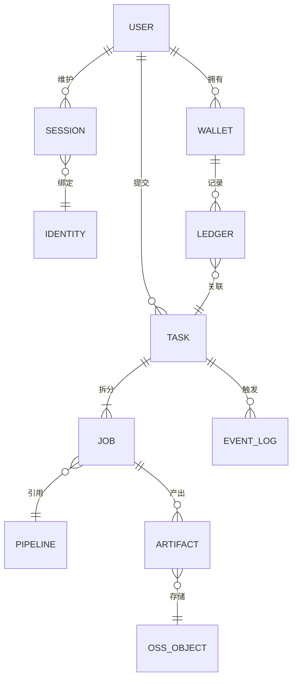
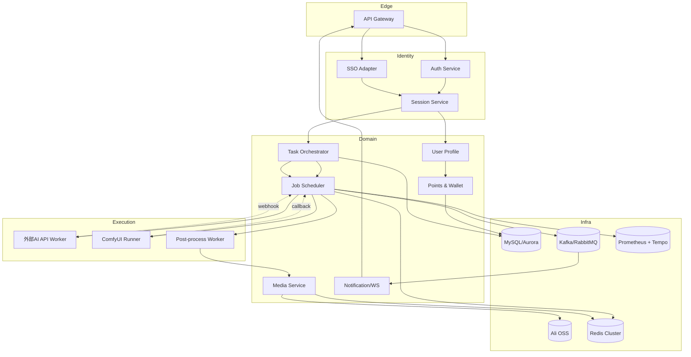

# PODI 后端架构与业务模型

## 1. 背景与目标
本项目需要统一站内登录与第三方跳转用户的身份体系，保障图片生成链路（上传、处理、存储）在高并发场景下的可靠性，并通过积分机制对算力消费进行核算。本文档位于仓库根目录，供前端（podi-design-web-dev）与后端团队共享，用于：
- 描述整体业务域模型与关键数据实体；
- 规划各后端服务的职责拆分、接口输出以及前端如何消费这些接口；
- 列举登录/任务/积分/存储等核心流程的处理策略与容错思路；
- 形成后续重构时可引用的索引和待补充的 API 合同。

## 2. 业务域模型

- **Identity**：统一抽象站内账号、本地 Token、第三方 SSO；需记录来源渠道、权限等级与积分策略。
- **Task/Job**：用户层面的一次操作定义为 Task，落地执行时根据 action 拆成多个 Job（如外部 API 调用、ComfyUI 节点、后处理 Job）。
- **Artifact/OSS_Object**：所有生成的图片、缩略图、压缩包都映射到 OSS 对象，并含加密策略、ACL、签名 URL。
- **Wallet/Ledger**：积分账户，支持冻结、扣款、退款、补扣，Ledger 记录任务 ID、渠道、单价等字段，便于对账。

## 3. 服务拓扑


### 职责要点
- **API Gateway**：统一鉴权、限流、注入 TraceId，与前端 `IdentitySource` 对齐。
- **Auth/SSO Adapter**：支持密码、短信、第三方 OAuth/OIDC；SSO 回调时若无账号则创建受限用户并绑定渠道。
- **Session Service**：生成 Access/Refresh Token，记录设备、渠道、权限配置。
- **Task Orchestrator**：校验参数、冻结积分、拆解 Job、写入任务队列，对外提供列表/查询 API。
- **Job Scheduler**：根据 action、渠道、API key 并发上限派发 Worker；支持重试、降级、熔断。
- **Media Service**：STS 颁发上传凭证、处理 OSS 回调、生成下载签名、追踪对象元数据。
- **Wallet Service**：积分账户与流水、套餐管理、扣减/释放补偿、导出能力。
- **Notification**：任务状态驱动 WebSocket、Webhook、站内通知，支持失败重试与用户偏好。

## 4. 身份与权限流程
1. **站内登录**：`POST /auth/login`→返回 JWT；Session 写 `channel=local`，后续 Task API 校验角色与配额。
2. **第三方跳转**：伙伴携带 `state`/`token` 调 SSO Adapter→验证并回传用户资料→必要时创建 `ExternalUser`（只读资料、受限权限），Session 标记 `channel=partnerX` 并加载对应积分策略。
3. **混合会话**：同一用户可绑定多个 Identity，切换身份需刷新 Token；前端带上 `X-Identity-Source`，后端做审计。
4. **权限治理**：Gateway ACL 结合 `role`、`channel`、`quota tier` 决定可访问工具、最大并发、OSS 下载权限。

## 5. 图片链路与容错
### 上传阶段
- 前端向 Media Service 申请上传地址和 STS，携带 `taskId/action/userId/channel` 元数据。
- OSS 回调校验签名→写入 `media_objects` 表→触发 Task Orchestrator（若是预上传流程）。

### 处理阶段
| 阶段 | 说明 | 容错策略 |
|------|------|----------|
| Pre-check | 校验积分、参数、API key 可用性 | 缓存第三方配额、失败回滚积分冻结 |
| Scheduler | 根据 action 路由至 EXTAPI/COMFY | Redis 令牌桶、每 key 信号量、动态降级 |
| Execution | Worker 调接口或 ComfyUI Flow | 熔断+重试、备用 key 列表、ComfyUI HPA | 
| Post-process | 图片校验、加水印、写 OSS | 幂等任务 ID、失败可重放 | 

### 失败处理
- Job 状态枚举：`PENDING/PROCESSING/SUCCEEDED/FAILED/RETRYING/TIMEOUT/DEGRADED`。
- 第三方限流：Scheduler 将 Job 放入 `DEGRADED` 队列并报警，可切换备用 key 或等待令牌恢复。
- ComfyUI 故障：通过 MQ 重派任务，使用健康探针 + HPA 自动恢复；必要时切换到备用工作流。

## 6. 积分经济模型
- **冻结+扣减**：Task 提交前 Wallet 先 `freeze(points)`，Job 成功后 `confirm`；失败/超时则 `release`。保证任务和积分强关联。
- **计费维度**：Action、分辨率、并发渠道、API 成本决定单价；第三方渠道可配置赞助账户代付。
- **积分不足**：Wallet 返回 `INSUFFICIENT_FUNDS`，Task 服务写事件，Notification 推送，引导充值/兑换。
- **对账**：`ledger` 表按日导出，与 `task_event`、OSS 账单对比；支持人工补扣与运营补偿。

## 7. 安全与可观测性
- **OSS**：使用私有仓 + 临时签名 + ACL；下载接口要求 Task 所属用户或授权管理员。
- **API Key 管理**：依赖 KMS/Secrets Manager；Worker 通过短期凭证拉取，轮换时 Scheduler 热更新。
- **审计**：`event_log` 记录身份来源、任务参数摘要（脱敏后）、OSS 路径、积分变化、外部接口响应码。
- **限流**：Gateway 按 IP + 用户 + 渠道；Scheduler 针对每个 action、API key、用户设置并发上限；ComfyUI 侧使用队列 token。
- **可观测性**：统一 TraceId；指标覆盖任务排队时长、外部 API 成功率、积分扣减失败率、OSS 上传成功率等，通过 Prometheus/Grafana + Tempo 查看。

## 8. 流程索引
| 流程 | 参考文档/模块 | 说明 |
|------|---------------|------|
| 登录 & Session | 前端：`src/pages/Login`, `src/pages/SSO`; 后端：Auth/SSO Adapter, `docs/api.md §2` | 登录入口、SSO 处理与 Token 生成 |
| 任务提交 | 前端：`docs/task-submission-flow.md`; 后端：Task Orchestrator | 参数校验、入队、状态回写 |
| 任务监控 | 前端：`docs/async-task-monitoring.md`; 后端：Notification Hub | 轮询、可见性切换、状态推送 |
| OSS 上传 | 前端：Upload 组件；后端：Media Service（待补 API） | STS、回调、ACL 设置 |
| 积分流水 | 前端：`src/services/pointsAPI.ts`; 后端：Wallet Service | 扣减、统计、导出 |
| 故障处理 | 前端：错误 UI、`docs/error-codes.md`; 后端：Task/Job 错误码、降级策略 | 一致的错误展示与重试逻辑 |

## 10. 前后端协作指引
1. **接口契约管理**：所有新增/变更 API 先在根目录的合同文件中更新，再同步到 `docs/api.md`，前端在 `services/` 中按模块封装，后端保证版本号和兼容期。
2. **Mock 与联调**：后端提供 Swagger + Mock 服务器，前端在 Vite 代理中配置 `/api/*` 指向 Mock，待接口稳定后切换真实域名；联调阶段通过 `TraceId` 定位问题。
3. **事件订阅**：任务状态、积分扣减、OSS 回调等实时事件统一走 Notification Hub，前端订阅 WebSocket/Server-Sent Events；后端提供重放接口以便排障。
4. **安全策略同步**：OSS 签名、第三方跳转参数、API key 轮换政策需在版本发布前告知前端，避免缓存导致的访问异常。
5. **异常演练**：每个大版本前执行“限流/积分不足/OSS 故障”演练，前端验证提示与降级路径，后端验证自动恢复与告警流程。

## 9. 后续工作
1. 在根目录补全 Media Service、Wallet Service 的正式 API 定义（REST + Webhook）。
2. 设计数据库表：`users/identities/sessions`, `tasks/jobs/job_events`, `wallets/ledger`, `media_objects`。
3. 搭建 PoC：包含 Gateway、Auth、Task、Wallet、Worker skeleton，验证限流、积分扣减与 ComfyUI 回调链路。

## 11. Media Service API 合同（Python 实现）
Media Service 由 Python（推荐 FastAPI + boto3）实现，负责上传凭证、回调校验、对象元数据和下载签名。

### 11.1 上传前置接口
```http
POST /api/media/v1/sts
Authorization: Bearer <token>
Content-Type: application/json

{
  "taskId": "tsk_123",
  "action": "hires",
  "channel": "local",     // IdentitySource
  "fileName": "origin.png",
  "mimeType": "image/png",
  "fileSize": 5242880
}
```
**响应**
```json
{
  "code": 200,
  "data": {
    "bucket": "pod-oss-private",
    "objectKey": "uploads/tsk_123/origin.png",
    "policy": "base64==",
    "signature": "string",
    "accessKeyId": "STS...",
    "host": "https://oss-xx.aliyuncs.com",
    "expireIn": 600
  }
}
```
- Python 侧使用 STS AssumeRole，结合 `taskId/action/channel` 写入自定义 Meta，供回调识别。
- 前端 `EnhancedImageUpload` 在获得凭证后直接 PUT/POST 至 OSS；失败需重新请求 STS。

### 11.2 OSS 回调
OSS 触发回调到 Media Service：
```http
POST /api/media/v1/oss-callback
x-oss-signature: ...
x-oss-pub-key-url: ...

{
  "bucket": "pod-oss-private",
  "object": "uploads/tsk_123/origin.png",
  "size": 5242880,
  "mimeType": "image/png",
  "meta": {
    "taskId": "tsk_123",
    "action": "hires",
    "userId": "u_001"
  }
}
```
- Python 端校验签名（官方 SDK），将对象写入 `media_objects` 表：`object_key`, `user_id`, `task_id`, `action`, `channel`, `size`, `hash`, `status`。
- 若 `action` 为预上传阶段，回调成功后通知 Task Orchestrator 创建 Job。

### 11.3 下载签名
```http
POST /api/media/v1/signed-download
Authorization: Bearer <token>

{
  "objectKey": "results/tsk_123/result.png",
  "ttl": 300
}
```
**响应**
```json
{
  "code": 200,
  "data": {
    "url": "https://.../result.png?Signature=...&Expires=..."
  }
}
```
- 后端检查请求者是否为任务所属用户或具备管理员/分享权限。
- 前端 Gallery/TaskDetail 调用该接口获取短期下载 URL，避免暴露 OSS 公网地址。

### 11.4 错误码
| code | message | 说明 | 前端处理 |
|------|---------|------|---------|
| MEDIA_STS_INVALID_PARAM | 参数非法 | taskId/action 缺失或不受支持 | 提示“请重新上传”|
| MEDIA_UPLOAD_UNAUTHORIZED | 身份无权限上传 | channel 与权限策略不匹配 | 禁止继续流程 |
| MEDIA_CALLBACK_INVALID | 回调签名失败 | OSS 回调异常 | 记录日志并提示稍后重试 |
| MEDIA_DOWNLOAD_DENIED | 无权限下载该文件 | 非任务所有者 | 提示“没有下载权限” |

## 12. Wallet Service API 合同（Python 实现）
Wallet Service 可使用 FastAPI + SQLAlchemy，提供积分账户、流水、冻结/扣减能力。

### 12.1 冻结/扣减
```http
POST /api/wallet/v1/freeze
Authorization: Bearer <token>

{
  "userId": "u_001",
  "taskId": "tsk_123",
  "action": "hires",
  "points": 50,
  "channel": "local"
}
```
**响应**
```json
{
  "code": 200,
  "data": { "holdId": "hold_abc", "balance": 450 }
}
```
- Task Orchestrator 在提交任务前调用 `freeze`，记录 `holdId`。
- 任务成功后调用 `confirm`：`POST /api/wallet/v1/confirm { "holdId": "hold_abc" }`；失败或超时调用 `release`。

### 12.2 流水查询
```http
GET /api/wallet/v1/transactions?userId=u_001&page=1&pageSize=20
Authorization: Bearer <token>
```
**响应** 包含 `changeType`、`points`, `beforeBalance`, `afterBalance`, `taskId`, `description` 等字段，对应前端 `PointsHistoryPage`。

### 12.3 统计
```http
GET /api/wallet/v1/statistics?userId=u_001
```
返回 `totalPoints`, `tempPoints`, `frozenPoints`, `grantedToday` 等指标，与 `PointsProvider` 对接，触发动画。

### 12.4 错误码
| code | message | 说明 | 前端处理 |
|------|---------|------|---------|
| WALLET_INSUFFICIENT | 积分不足 | 展示充值提示、阻止提交 |
| WALLET_HOLD_CONFLICT | 冻结冲突 | 可能重复提交 | 前端提示重试，并避免多次提交 |
| WALLET_HOLD_NOT_FOUND | holdId 不存在 | confirm/release 错误 | 记录日志 |
| WALLET_SERVICE_UNAVAILABLE | 钱包不可用 | 后端降级 | 前端提示“服务繁忙” |

## 13. Task/Job 数据模型与事件
### 13.1 数据表（示例）
- `tasks`: `task_id`, `user_id`, `action`, `status`, `channel`, `points`, `created_at`, `updated_at`。
- `jobs`: `job_id`, `task_id`, `type` (外部 API / ComfyUI / Post-process), `status`, `priority`, `api_key_id`, `retry_count`。
- `job_events`: `event_id`, `job_id`, `status`, `message`, `payload`, `created_at`。
- `task_events`: `event_id`, `task_id`, `type` (submit/success/fail/points_deducted等), `metadata`。
- `media_objects`: `object_key`, `task_id`, `user_id`, `status`, `hash`, `size`, `created_at`。
- `wallet_ledger`: `ledger_id`, `user_id`, `task_id`, `change_type`, `points`, `before_balance`, `after_balance`, `channel`, `created_at`。

### 13.2 事件 Topic
- `task.lifecycle`: Task 提交/成功/失败，供 Notification Hub 推送。
- `job.status`: Job 状态变化，供监控/调度系统使用。
- `wallet.deduction`: 积分扣减/释放事件，供对账。
- Python 侧可以使用 Kafka（confluent-kafka-python）或 RabbitMQ（pika），并附带 `traceId`, `identitySource`。

### 13.3 前后端字段对齐
- 前端 Task 组件使用 `taskId`, `action`, `status`, `progress`, `resultUrl`，需与 `tasks` 表字段一致。
- Notification 推送的 payload：
```json
{
  "taskId": "tsk_123",
  "status": "completed",
  "jobs": [{"jobId": "job_a", "type": "ext_api", "status": "success"}],
  "resultUrl": "results/tsk_123/result.png",
  "points": 50
}
```
- Event `status` 值与前端枚举保持一致：`pending`, `processing`, `completed`, `failed`, `canceled`。

## 14. Notification 协议
Python 端建议使用 FastAPI + WebSocket/SSE、以及 Celery/Redis 进行消息推送，必要时同步 Webhook。

### 14.1 WebSocket/SSE
- **连接**：`GET /api/notify/v1/stream?token=<jwt>&channel=<local|partner>` 支持 WebSocket（默认）与 SSE（`Accept: text/event-stream`）。
- **鉴权**：Gateway 注入 `Authorization`；后端校验 Token 并下发 `connectionId`，用于重放。
- **消息格式**：
```json
{
  "type": "task.status",    // 或 wallet.points
  "traceId": "...",
  "identitySource": "partnerX",
  "payload": {
    "taskId": "tsk_123",
    "status": "processing",
    "progress": 40,
    "points": 50
  },
  "timestamp": 1736900000
}
```
- **断线重连**：前端在 `Last-Event-ID` 或 WebSocket `reconnect` 时附带最近收到的 `eventId`，后端通过 Redis/Kafka 缓存近 10 分钟事件供 `GET /api/notify/v1/replay?since=<eventId>` 重放。

### 14.2 Webhook（可选）
- 合作方或内部服务可注册 Webhook：`POST /api/notify/v1/webhooks`，字段包括 `callbackUrl`, `eventTypes`, `secret`。
- 推送带 HMAC-SHA256 签名：`X-POD-Signature: sha256=...`，body 即上方消息格式。
- 失败重试：指数退避，最多 6 次；若连续失败，标记为 `disabled` 并发告警。

### 14.3 前端集成
- `docs/async-task-monitoring.md` 的轮询可切换到 WebSocket 模式：在 `useTaskMonitoring` 中建立连接、处理 `task.status` 与 `wallet.points` 事件，必要时回退到轮询。
- 若用户切换身份或登出，需要关闭连接并重新鉴权。

## 15. SSO 渠道策略
SSO Adapter 以 Python（FastAPI）实现，支持多合作方。每个渠道都包含 signKey、state 验证规则及积分策略。

### 15.1 渠道配置示例
```yaml
partners:
  partnerA:
    signKey: "base64secret=="
    allowedActions: ["hires", "pattern", "seamless"]
    pointsPolicy: "sponsor"   # 由伙伴代付
    roles: ["user"]
  partnerB:
    oidcIssuer: "https://idp.partnerb.com"
    clientId: "pod-ai"
    pointsPolicy: "shared"    # 与自有账号共享积分
    roles: ["user", "vip"]
```

### 15.2 登录流程约束
1. 回调入口：`GET /sso/callback?partner=partnerA&ticket=<encrypted>`。
2. Adapter 根据 `partner` 解析参数：
   - **Ticket 模式**：使用 AES/HMAC 验签，字段包括 `platform|token|user_id|account`。
   - **OIDC 模式**：按照标准授权码流程，与 Issuer 校验 `state`、`nonce`。
3. 若账号不存在，创建 `ExternalUser` 并绑定 `identitySource=partnerA`；加载对应积分策略（自付/代付/共享）。
4. Session Service 返回 JWT，`IdentitySource` 存于 Token claim，前端 `AuthProvider` 保存并用于任务/钱包 API。

### 15.3 权限与积分策略
- `allowedActions` 控制伙伴可访问的工具，Gateway 需校验 `action` 是否在列表内。
- `pointsPolicy` 可取：`self`（自付）、`sponsor`（伙伴支付）、`shared`（与主账号共享）。Wallet Service 依据策略选择扣款账户。
- 需要记录 `partnerUserId` 与 `userId` 的映射，供审计和数据统计使用。

## 16. Python 后端开发环境与规范
- **框架建议**：FastAPI（HTTP 层）+ SQLAlchemy（数据库）+ Pydantic（模型校验）+ Celery（异步 Job）+ Redis/Kafka（队列/消息）。
- **项目结构**：
```
backend/
  app/
    main.py
    routers/
    services/
    models/
    schemas/
    deps/
  celery_worker.py
  alembic/
  requirements.txt / pyproject.toml
```
- **环境**：Python 3.11，使用 Poetry 或 pip-tools 锁依赖；开发环境提供 `.env`（数据库/Redis/OSS/KMS 配置），测试环境通过 Docker Compose（PostgreSQL/MySQL、Redis、MinIO 作为 OSS 模拟）。
- **Mock/Swagger**：FastAPI 自动生成 `/docs`（Swagger）与 `/openapi.json`；提供 `/mock` 路由返回固定数据供前端开发。
- **测试**：Pytest + coverage，集成测试覆盖 Task 提交流程（含积分、Media 回调）。CI 配置在 GitHub Actions 或自建 Jenkins。
- **代码风格**：PEP8 + Ruff/Lint；格式化使用 Black；提交前跑 `pytest`、`ruff check`、`black --check`。
